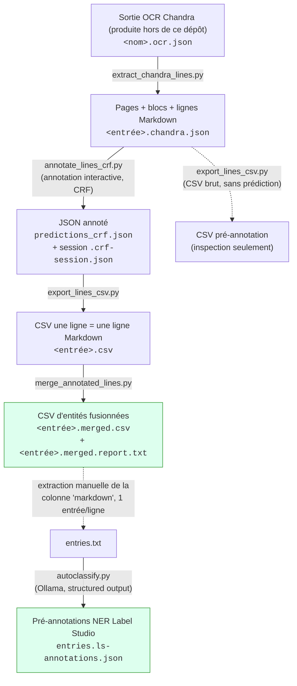
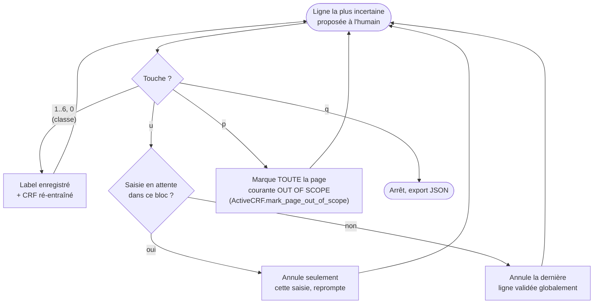
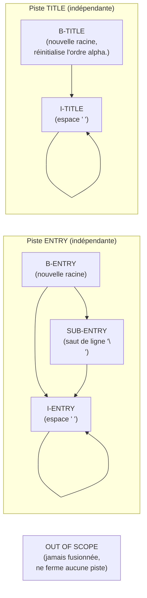

# Numérotation révolutionnaire

## Prérequis

- Python 3.12 ou plus récent
- [uv](https://docs.astral.sh/uv/)
- Les sorties OCR Chandra d'un annuaire (`<nom>.ocr.json` et `<nom>.ocr.md`),
  produites en local par un projet séparé : l'OCR n'est pas exécuté par cette
  chaîne (voir par exemple `annuaires/1808_AD75-PER292/`)

## Installation

Depuis la racine du dépôt :

```bash
uv sync
```

## Pipeline d'annotation d'annuaires historiques

Cette chaîne de traitement transforme un PDF d'annuaire ancien numérisé en une base de données d'entrées à l'intérieur d'une hiérarchie de titres.

1. un **CSV d'entrées à l'intérieur d'une hiérarchie de titres**, produit par appren annotation CRF ligne par ligne assistée par apprentissage actif ;
2. un **jeu de pré-annotations NER pour Label Studio**, où chaque entrée est
   décomposée en empans (SUBJ / DESC / ADDR) via un LLM local (Ollama).

### Vue d'ensemble



Les deux boîtes vertes (`F` et `H`) sont les deux livrables finaux. Tout ce
qui précède sert à les construire ; `E2` est un chemin secondaire (le même
`export_lines_csv.py` peut aussi convertir le JSON brut de
`extract_chandra_lines.py`, avant toute annotation, pour une inspection
rapide en CSV).

Chaque script est indépendant et s'utilise en ligne de commande ; le nom du
fichier de sortie de chaque étape découle par défaut de son entrée
(`-o/--output` a toujours une valeur par défaut dérivée), donc l'ensemble
s'enchaîne sans avoir à nommer explicitement chaque fichier intermédiaire.

## Étape 1 — Extraction des lignes : `extract_chandra_lines.py`

Parse le HTML brut de chaque bloc de données Chandra et le convertit en
lignes Markdown, avec leur provenance (page, bloc, position).

```
python extract_chandra_lines.py mon_annuaire.ocr.json
```

- **Entrée :** le JSON OCR brut de Chandra (`<nom>.ocr.json`).
- **Sortie :** `<entrée>.chandra.json` — une copie du JSON d'entrée où
  chaque page reçoit une liste `data_blocks`, chacun portant sa liste de
  `lines` (`uid`, `line_index`, `markdown`).
- **Option utile :** `--notables` (exporte chaque cellule de tableau comme
  une ligne séparée, sans syntaxe Markdown de tableau).
- Le schéma de ce JSON (pages → `data_blocks` → `lines`) est le **contrat
  partagé** de tout le reste du pipeline ; il est décrit et validé une seule
  fois dans `chandra_document.py` (`iter_line_locations`), réutilisé par
  `annotate_lines_crf.py` et `export_lines_csv.py`.

## Étape 2 — Annotation interactive : `annotate_lines_crf.py`

Cœur du pipeline : un CRF (`python-crfsuite`) entraîné au fur et à mesure
propose les lignes les plus utiles à annoter (échantillonnage par
incertitude après une phase de graine diversifiée), et enregistre la
session pour pouvoir la reprendre.

```
python annotate_lines_crf.py mon_annuaire.chandra.json
```

- **Entrée :** le JSON de l'étape 1 (ou un JSON déjà partiellement annoté
  par ce même script, pour continuer une annotation dans un nouveau
  fichier).
- **Sortie finale :** `predictions_crf.json` par défaut (`-o/--output`) —
  le même JSON, où chaque ligne reçoit `prediction`, `provenance`
  (`human`/`model`/`unclassified`), `probability` et `timestamp`.
- **Session :** `<entrée>.crf-session.json` (par défaut), réécrite après
  chaque action ; permet de reprendre l'annotation exactement où elle a été
  arrêtée. `--reset-session` l'ignore volontairement.
- **Classes annotées :** `B-ENTRY`, `I-ENTRY`, `SUB-ENTRY`, `B-TITLE`,
  `I-TITLE`, `OUT OF SCOPE`, `¯\_(ツ)_/¯` (incertain).
- **`--seed-size`** : nombre d'annotations diversifiées avant de basculer
  sur l'échantillonnage par incertitude (défaut : 12).

Boucle d'annotation, simplifiée :



Points de conception à connaître :

- La feature CRF `is_page_start` (rupture de page) aide le modèle sans
  utiliser le numéro de page brut (qui généraliserait mal d'un document à
  l'autre) ; le numéro de page réel (`p.N`) n'est utilisé que pour
  l'affichage humain (contexte, séparateurs de page).
- La probabilité exportée est un **décodage postérieur** (argmax des
  marginales CRF), pas un décodage de Viterbi : la probabilité affichée
  correspond toujours exactement à l'étiquette exportée.
- Le dashboard (`rich`) est à deux colonnes : contexte du document à
  gauche, statistiques (progression, légende, transitions apprises,
  probabilités des lignes candidates) à droite.

## Étape 3 — Aplatissement en CSV : `export_lines_csv.py`

Convertit le JSON (annoté ou non) en un CSV à plat, une ligne Markdown par
ligne de CSV.

```
python export_lines_csv.py predictions_crf.json
```

- **Entrée :** JSON de l'étape 1 (brut) ou de l'étape 2 (annoté).
- **Sortie :** `<entrée>.csv` — colonnes `uid`, `page_index`,
  `chunk_index`, `data_block_index`, `line_index`, `data_block_bbox`,
  `data_block_label`, `markdown`, `prediction`, `provenance`,
  `probability`, `timestamp`.
- Utilisé sur un JSON brut (avant annotation), les colonnes
  `prediction`/`provenance`/`probability`/`timestamp` sont simplement
  vides — utile pour une inspection rapide sans annoter.

## Étape 4 — Reconstitution des entités : `merge_annotated_lines.py`

Recompose les entités logiques (une entrée d'annuaire, un titre de section)
à partir des classes ligne par ligne, et produit un rapport d'analyse.

```
python merge_annotated_lines.py mon_annuaire.csv
```

- **Entrée :** le CSV annoté de l'étape 3 (doit contenir une colonne
  `prediction` peuplée).
- **Sorties :**
  - `<entrée>.merged.csv` — une ligne par entité finale : `ENTRY`, `TITLE`
    ou `OUT OF SCOPE` (ou toute classe non reconnue, recopiée telle
    quelle) ;
  - `<entrée>.merged.report.txt` — comptages et cas à vérifier
    manuellement.

Règles de fusion (deux « pistes » indépendantes, ENTRY et TITLE, qui
restent ouvertes tant qu'aucune nouvelle racine `B-ENTRY`/`B-TITLE`
n'apparaît — c'est ce qui permet de « remonter » par-dessus des lignes
`OUT OF SCOPE` ou de l'autre famille) :



- Une `I-ENTRY`/`SUB-ENTRY`/`I-TITLE` sans ancre valable (rare : en
  pratique surtout en tout début de fichier) est repêchée comme nouvelle
  racine de son type, et **signalée dans le rapport** plutôt que perdue.
- L'ordre alphabétique des `ENTRY` est vérifié dans l'ordre chronologique
  réel du document (au moment où chaque entrée démarre, pas à son export
  différé), et **réinitialisé à chaque nouveau `TITLE`**. Les ruptures
  sont listées avec l'identifiant (`uid`) de l'entrée fautive.
- Toute classe qui n'est ni `OUT OF SCOPE` ni reconnue est traitée comme
  hors-champ et **signalée séparément** dans le rapport (garde-fou contre
  un futur renommage de classe côté annotation).

## Étape 5 — Pré-annotation NER pour Label Studio : `autoclassify.py`

Étape indépendante du CSV fusionné : à partir d'un fichier texte (une
entrée d'annuaire par ligne — typiquement la colonne `markdown` du CSV
fusionné, exportée manuellement une fois les `ENTRY` validées), interroge
un modèle Ollama local pour segmenter chaque entrée en empans classés, et
produit un fichier de prédictions Label Studio.

```
python autoclassify.py entries.txt
```

- **Entrée :** un fichier texte, une entrée par ligne.
- **Sortie :** `<entrée>.ls-annotations.json` — une tâche Label Studio par
  ligne (`data.text` + `predictions[0].result[]` avec `start`/`end`
  calculés par recherche dans le texte, pas fournis par le modèle).
- **Classes :** `SUBJ` (entité désignée), `DESC` (descriptif d'activité),
  `ADDR` (adresse) — indépendantes des classes BIO des étapes 2-4 : ce
  script classe des empans *à l'intérieur* d'une entrée déjà reconstituée,
  pas des lignes.
- Utilise le mode **structured output** d'Ollama (schéma JSON Pydantic
  passé à `format=`), pas `format="json"` libre : la forme de la réponse
  est contrainte, pas seulement sa validité JSON.
- Si le modèle altère le texte d'un segment (le repérage par recherche
  échoue), l'entrée est marquée en échec et journalée — jamais d'empan mal
  positionné produit en silence.
- `--from-name`/`--to-name` doivent correspondre aux noms des balises
  `<Labels>`/`<Text>` de votre configuration Label Studio.

## Fichiers finaux et ce qu'ils contiennent

| Fichier | Produit par | Contenu |
|---|---|---|
| `<entrée>.merged.csv` | `merge_annotated_lines.py` | Une ligne par entité : `ENTRY`, `TITLE` ou `OUT OF SCOPE`, avec texte fusionné et provenance (uid, page, etc. concaténés) |
| `<entrée>.merged.report.txt` | `merge_annotated_lines.py` | Comptages (entités finales, lignes fusionnées) et listes de cas à vérifier (ancres manquantes, ordre alphabétique) |
| `<entrée>.ls-annotations.json` | `autoclassify.py` | Pré-annotations NER par empans (SUBJ/DESC/ADDR), importables directement dans Label Studio |

## Conventions communes à tous les scripts

- CLI en français via `argparse` ; `-o/--output` optionnel avec une valeur
  par défaut dérivée du nom d'entrée.
- Sortie console colorée via `rich` (`✅` succès, `[bold red]Erreur :[/]`
  pour les échecs attendus).
- Vérification de l'existence des fichiers d'entrée avant tout traitement ;
  gestion d'erreurs typée plutôt que des `except Exception` génériques
  (à l'exception assumée du traitement par lot LLM dans `autoclassify.py`,
  où l'objectif est la résilience du lot face à des pannes réseau/modèle
  imprévisibles).
