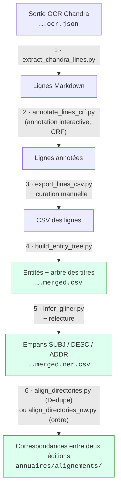

# Numérotation révolutionnaire

Chaîne de traitement qui transforme des annuaires parisiens numérisés du
début du XIXᵉ siècle en données structurées :

1. des **entrées** (ENTRY) rangées dans la **hiérarchie des titres** de
   l'annuaire (TITLE), obtenues par une annotation ligne par ligne assistée
   par un CRF en apprentissage actif ;
2. chaque entrée **segmentée en empans** `SUBJ` (qui ?) / `DESC` (quoi ?) /
   `ADDR` (où ?) par un modèle GLiNER, avec les entrées à relire en priorité
   signalées ;
3. les **correspondances** entre les entrées de deux éditions d'un annuaire,
   par Dedupe ou par un alignement fondé sur l'ordre des entrées, toujours
   entre rubriques appariées d'une édition à l'autre, avec pour
   chaque paire une incertitude (faible, moyenne, forte) et ses motifs, qui
   orientent la relecture humaine.

## Prérequis

- Python 3.12 ou plus récent
- [uv](https://docs.astral.sh/uv/)
- Les sorties OCR Chandra d'un annuaire (`<nom>.ocr.json` et `<nom>.ocr.md`).
  L'OCR n'est pas exécuté par cette chaîne : il est produit en local par un
  projet séparé.

## Installation

```bash
uv sync
```

## Vue d'ensemble



Chaque étape est un script autonome en ligne de commande ; le nom de sa
sortie découle par défaut de celui de son entrée, et les fichiers
s'accumulent à côté de leur entrée dans `annuaires/<volume>/<plage>/`.

Les corrections humaines (classes et texte des lignes, empans NER,
correspondances) se font directement dans les CSV produits, en marquant
`corrige = oui` ; chaque script les capture dans un patch versionné
(`data/curation/`, `data/alignement/`) et les réapplique quand on le relance,
et s'arrête sans rien écrire si une correction ne s'applique plus (voir
[`docs/guide_curation.md`](docs/guide_curation.md)).

## Documentation

- [`docs/pipeline.md`](docs/pipeline.md) — **documentation détaillée** :
  organisation des fichiers, chaque étape (entrées, sorties, options,
  schémas), audits, formats et code partagé ;
- [`docs/guide_curation.md`](docs/guide_curation.md) — **guide de la
  curation** : corriger les lignes, le NER et l'alignement à la main sans
  perdre ses corrections quand on relance la chaîne (exemples) ;
- [`docs/guide_annotation_ner.md`](docs/guide_annotation_ner.md) —
  conventions d'annotation des empans `SUBJ` / `DESC` / `ADDR` ;
- [`docs/alignement_ordonne.md`](docs/alignement_ordonne.md) — méthode de
  l'alignement ordonné (Needleman-Wunsch + pair-HMM) et son évaluation sur
  un gold d'inversions ;
- [`docs/guide_relecture_alignement.md`](docs/guide_relecture_alignement.md) —
  conventions de relecture des correspondances (motifs, réponses OUI / NON /
  INCERTAIN, patch).

## Commandes principales

Toutes les commandes se lancent depuis la racine du dépôt. Celles qui
écrivent des fichiers de données simulent par défaut (elles affichent ce
qu'elles écriraient) : `--apply` écrit.

```bash
# Étapes 1 à 4 sur une plage de pages (P = annuaires/<volume>/<plage>/<volume>.<plage>)
uv run extract_chandra_lines.py $P.ocr.json --apply                 # → $P.ocr.lines.json
uv run annotate_lines_crf.py $P.ocr.lines.json --apply              # → $P.ocr.lines.annotated.json
uv run export_lines_csv.py $P.ocr.lines.annotated.json --apply      # → $P.ocr.lines.annotated.csv
# … curation manuelle dans $P.ocr.lines.annotated.csv (corrige = oui), puis relancer l'export
uv run build_entity_tree.py $P.ocr.lines.annotated.csv --apply

# Étape 5 : segmentation NER, puis exploration du résultat
uv run infer_gliner.py <…>.merged.csv --model models/<nom>.gliner-model --apply
uv run streamlit run tools/display_directory.py

# Étape 6 : alignement de deux volumes complets, puis exploration
uv run align_directories.py annuaires/<A> annuaires/<B> --apply      # Dedupe
uv run align_directories_nw.py annuaires/<A> annuaires/<B> --apply   # ordre des entrées
uv run streamlit run tools/display_alignment.py
uv run tools/export_alignment.py annuaires/alignements/<A>__<B>.nw.csv --excel --apply   # jointure CSV lisible
uv run tools/sample_alignment_gold.py annuaires/<A> annuaires/<B> --apply   # gold d'inversions à étiqueter (une fois)
uv run tools/audit_alignment_review.py data/alignement/<A>__<B>.gold-inversions.csv   # → rapports/audit_alignement/

# Audits
uv run audit_crf_features.py      # CRF de l'étape 2 → rapports/audit_crf/
uv run audit_ner.py --split dev --model models/<nom>.gliner-model   # → rapports/audit_ner/

# Tests (unittest)
uv run python -m unittest discover -s tests
```

## Organisation du dépôt

| Chemin | Contenu |
|---|---|
| `*.py` (racine) | Scripts des étapes et des audits |
| `lib/` | Code partagé (schéma des documents, CRF, NER, alignement, statistiques) |
| `tools/` | Viewers Streamlit, export de la jointure alignée, outils d'entraînement et de tirage du gold NER, gold et audit de la relecture de l'alignement |
| `data/ner/` | Gold d'évaluation et jeu d'entraînement NER (Label Studio) |
| `data/alignement/` | Paires étiquetées pour Dedupe, patchs manuels d'alignement et gold des inversions |
| `docs/` | Documentation |
| `tests/` | Tests unitaires |
| `annuaires/` | Dossiers de travail par volume (hors git) |
| `models/` | Modèles GLiNER entraînés (hors git) |
| `rapports/` | Rapports d'audit |
