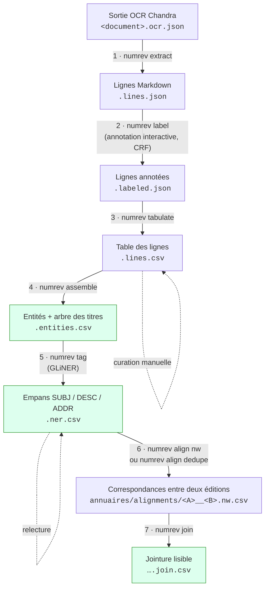

# Numérotation révolutionnaire

Chaîne de traitement qui transforme des annuaires parisiens numérisés du
début du XIXᵉ siècle en données structurées :

1. des **entrées** (ENTRY) rangées dans la **hiérarchie des titres** de
   l'annuaire (TITLE), obtenues par une annotation ligne par ligne assistée
   par un CRF en apprentissage actif ;
2. chaque entrée **segmentée en empans** `SUBJ` (qui ?) / `DESC` (quoi ?) /
   `ADDR` (où ?) par un modèle GLiNER, avec les entrées à relire en priorité
   signalées ;
3. les **correspondances** entre les entrées de deux éditions d'un annuaire,
   par un alignement fondé sur l'ordre des entrées ou par Dedupe, toujours
   entre rubriques appariées d'une édition à l'autre, avec pour chaque paire
   une incertitude (faible, moyenne, forte) et ses motifs, qui orientent la
   relecture humaine.

## Prérequis

- Python 3.12 ou plus récent
- [uv](https://docs.astral.sh/uv/)
- Les sorties OCR Chandra d'un annuaire (`<document>.ocr.json`). L'OCR n'est
  pas exécuté par cette chaîne : il est produit en local par un projet
  séparé.

## Installation

```bash
uv sync            # installe les dépendances et la commande `numrev`
uv run numrev      # liste des commandes
```

## Vue d'ensemble

Tout passe par une seule commande, `numrev`. Les étapes 1 à 5 traitent une
**plage de pages** d'un volume (un *document*), les étapes 6 et 7 une
**paire d'annuaires** complets. Chaque étape ajoute son suffixe au nom du
document :



Les corrections humaines (classes et texte des lignes, empans NER,
correspondances) se font directement dans les CSV produits, en marquant
`corrige = oui` ; chaque commande les capture dans un patch versionné
(`data/curation/`, `data/alignment/`) et les réapplique quand on la relance,
et s'arrête sans rien écrire si une correction ne s'applique plus (voir
[`docs/guide_curation.md`](docs/guide_curation.md)).

## Commandes

Toutes les commandes se lancent depuis la racine du dépôt. Celles qui
écrivent des fichiers de données **simulent par défaut** (elles affichent ce
qu'elles écriraient) : `--apply` écrit. `uv run numrev <commande> --help`
détaille les options.

```bash
# Étapes 1 à 5, sur une plage de pages
D=annuaires/1808_AD75-PER292/7-186/1808_AD75-PER292.7-186
uv run numrev extract  $D.ocr.json --apply        # → $D.lines.json
uv run numrev label    $D.lines.json --apply      # → $D.labeled.json (annotation interactive)
uv run numrev tabulate $D.labeled.json --apply    # → $D.lines.csv, à corriger à la main
uv run numrev assemble $D.lines.csv --apply       # → $D.entities.csv (+ .entities.report.txt)
uv run numrev tag      $D.entities.csv --model models/<nom>.gliner-model --apply   # → $D.ner.csv, à relire

# Étapes 6 et 7, sur une paire d'annuaires complets
uv run numrev align nw annuaires/<A> annuaires/<B> --apply       # alignement ordonné, sans apprentissage
uv run numrev align dedupe annuaires/<A> annuaires/<B> --apply   # alternative : Dedupe (+ patch manuel)
uv run numrev join annuaires/alignments/<A>__<B>.nw.csv --excel --apply   # jointure CSV pour les historiens

# Consultation
uv run numrev view directory     # un annuaire, empans et entrées suspectes
uv run numrev view alignment     # un alignement : relecture, décisions → patch
uv run numrev publish-viewer ../alignment-viewer --apply   # copie hébergée du viewer (Streamlit Cloud)

# Modèles et évaluation
uv run numrev gold ner --apply                    # tire le gold NER (une fois)
uv run numrev train-set --apply                   # jeu d'entraînement NER → data/ner/train.ls.json
uv run numrev train data/ner/train.ls.json --apply   # entraîne GLiNER (machine GPU)
uv run numrev audit ner --split dev --model models/<nom>.gliner-model   # → reports/ner/
uv run numrev audit crf                           # CRF de l'étape 2 → reports/crf/
uv run numrev gold alignment annuaires/<A> annuaires/<B> --apply   # gold d'inversions à étiqueter (une fois)
uv run numrev audit alignment data/alignment/<A>__<B>.gold-inversions.csv   # → reports/alignment/

# Tests (unittest) et mise en forme du code
uv run python -m unittest discover -s tests
uv run black src tests && uv run ruff check src tests
```

## Documentation

- [`docs/pipeline.md`](docs/pipeline.md) — **documentation détaillée** :
  organisation des fichiers, chaque étape (entrées, sorties, options,
  schémas), audits, formats et code ;
- [`docs/guide_curation.md`](docs/guide_curation.md) — **guide de la
  curation** : corriger les lignes, le NER et l'alignement à la main sans
  perdre ses corrections quand on relance la chaîne (exemples) ;
- [`docs/guide_annotation_ner.md`](docs/guide_annotation_ner.md) —
  conventions d'annotation des empans `SUBJ` / `DESC` / `ADDR` ;
- [`docs/alignement_ordonne.md`](docs/alignement_ordonne.md) — méthode de
  l'alignement ordonné (Needleman-Wunsch + pair-HMM) et son évaluation sur
  un gold d'inversions ;
- [`docs/guide_relecture_alignement.md`](docs/guide_relecture_alignement.md) —
  conventions de relecture des correspondances (motifs, réponses OUI / NON /
  INCERTAIN, patch).

## Organisation du dépôt

| Chemin | Contenu |
|---|---|
| `src/numrev/cli.py` | Point d'entrée `numrev` : la liste des commandes |
| `src/numrev/pipeline/` | Une commande par étape (1 à 7) |
| `src/numrev/viewers/` | Viewers Streamlit (`numrev view`) |
| `src/numrev/devtools/` | Gold, jeu d'entraînement, entraînement, audits |
| `src/numrev/crf/`, `ner/`, `alignment/` | Code partagé de chaque domaine |
| `src/numrev/paths.py` | Noms et emplacements des fichiers |
| `src/numrev/curation.py` | Protocole des corrections humaines rejouables |
| `tests/` | Tests unitaires |
| `docs/` | Documentation |
| `data/curation/` | Patchs des corrections humaines (lignes, NER) |
| `data/alignment/` | Paires étiquetées pour Dedupe, patchs d'alignement, gold des inversions |
| `data/ner/` | Gold d'évaluation et jeu d'entraînement NER (Label Studio) |
| `explorations/` | Notebooks exploratoires |
| `annuaires/` | Dossiers de travail par volume et sorties d'alignement (hors git) |
| `models/` | Modèles GLiNER entraînés (hors git) |
| `reports/` | Rapports d'audit |
