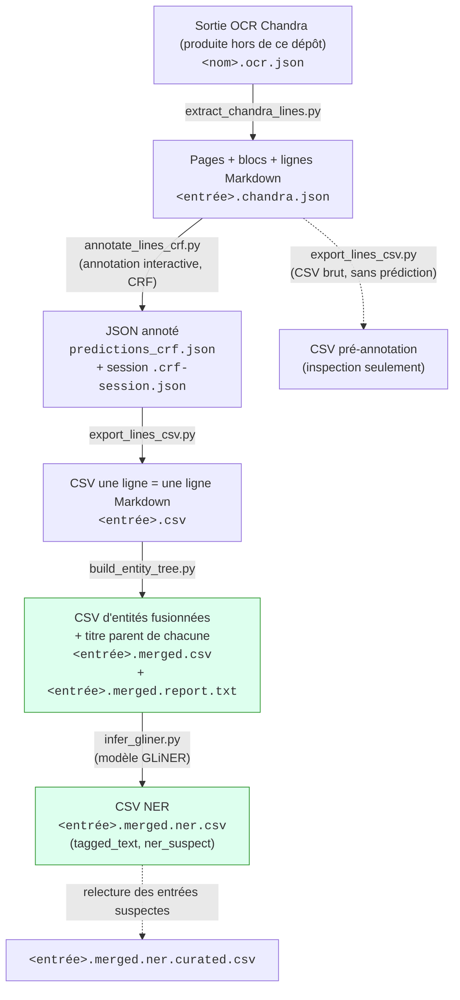
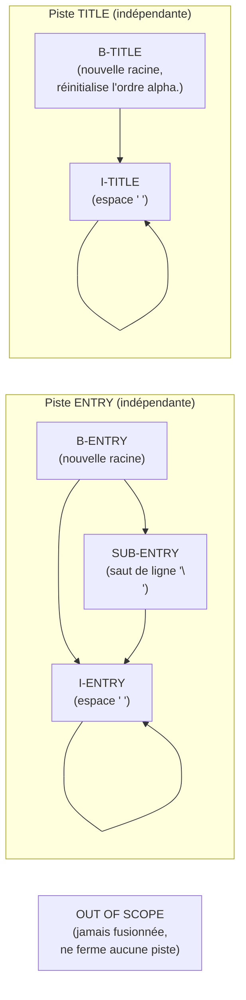

# Numérotation révolutionnaire

## Prérequis

- Python 3.12 ou plus récent
- [uv](https://docs.astral.sh/uv/)
- Les sorties OCR Chandra d'un annuaire (`<nom>.ocr.json` et `<nom>.ocr.md`),
  produites en local par un projet séparé : l'OCR n'est pas exécuté par cette
  chaîne (voir par exemple `annuaires/1808_AD75-PER292/`)

## Installation

Depuis la racine du dépôt :

```bash
uv sync
```

## Pipeline d'annotation d'annuaires historiques

Cette chaîne de traitement transforme un PDF d'annuaire ancien numérisé en une base de données d'entrées à l'intérieur d'une hiérarchie de titres.

1. un **CSV d'entrées à l'intérieur d'une hiérarchie de titres**, produit par une annotation CRF ligne par ligne assistée par apprentissage actif ;
2. le même CSV **segmenté en empans NER** (SUBJ / DESC / ADDR) par un modèle
   GLiNER, avec les entrées à relire en priorité signalées.

### Vue d'ensemble



Les deux boîtes vertes (`F` et `H`) sont les deux livrables finaux. Tout ce
qui précède sert à les construire ; `E2` est un chemin secondaire (le même
`export_lines_csv.py` peut aussi convertir le JSON brut de
`extract_chandra_lines.py`, avant toute annotation, pour une inspection
rapide en CSV).

Chaque script est indépendant et s'utilise en ligne de commande ; le nom du
fichier de sortie de chaque étape découle par défaut de son entrée
(`-o/--output` a toujours une valeur par défaut dérivée), donc l'ensemble
s'enchaîne sans avoir à nommer explicitement chaque fichier intermédiaire.

## Étape 1 — Extraction des lignes : `extract_chandra_lines.py`

Parse le HTML brut de chaque bloc de données Chandra et le convertit en
lignes Markdown, avec leur provenance (page, bloc, position).

```
python extract_chandra_lines.py mon_annuaire.ocr.json
```

- **Entrée :** le JSON OCR brut de Chandra (`<nom>.ocr.json`).
- **Sortie :** `<entrée>.chandra.json` — une copie du JSON d'entrée où
  chaque page reçoit une liste `data_blocks`, chacun portant sa liste de
  `lines` (`uid`, `line_index`, `markdown`).
- **Option utile :** `--notables` (exporte chaque cellule de tableau comme
  une ligne séparée, sans syntaxe Markdown de tableau).
- Le schéma de ce JSON (pages → `data_blocks` → `lines`) est le **contrat
  partagé** de tout le reste du pipeline ; il est décrit et validé une seule
  fois dans `chandra_document.py` (`iter_line_locations`), réutilisé par
  `annotate_lines_crf.py` et `export_lines_csv.py`.

## Étape 2 — Annotation interactive : `annotate_lines_crf.py`

Cœur du pipeline : un CRF (`python-crfsuite`) entraîné au fur et à mesure
propose les lignes les plus utiles à annoter (échantillonnage par
incertitude après une phase de graine diversifiée), et enregistre la
session pour pouvoir la reprendre.

```
python annotate_lines_crf.py mon_annuaire.chandra.json
```

- **Entrée :** le JSON de l'étape 1 (ou un JSON déjà partiellement annoté
  par ce même script, pour continuer une annotation dans un nouveau
  fichier).
- **Sortie finale :** `predictions_crf.json` par défaut (`-o/--output`) —
  le même JSON, où chaque ligne reçoit `prediction`, `provenance`
  (`human`/`model`/`unclassified`), `probability` et `timestamp`.
- **Session :** `<entrée>.crf-session.json` (par défaut), réécrite après
  chaque action ; permet de reprendre l'annotation exactement où elle a été
  arrêtée. `--reset-session` l'ignore volontairement.
- **Classes annotées :** `B-ENTRY`, `I-ENTRY`, `SUB-ENTRY`, `B-TITLE`,
  `I-TITLE`, `OUT OF SCOPE`, `¯\_(ツ)_/¯` (incertain).
- **`--seed-size`** : nombre d'annotations diversifiées avant de basculer
  sur l'échantillonnage par incertitude (défaut : 12).

Boucle d'annotation, simplifiée :


Points de conception à connaître :

- La feature CRF `is_page_start` (rupture de page) aide le modèle sans
  utiliser le numéro de page brut (qui généraliserait mal d'un document à
  l'autre) ; le numéro de page réel (`p.N`) n'est utilisé que pour
  l'affichage humain (contexte, séparateurs de page).
- La probabilité exportée est un **décodage postérieur** (argmax des
  marginales CRF), pas un décodage de Viterbi : la probabilité affichée
  correspond toujours exactement à l'étiquette exportée.
- Le dashboard (`rich`) est à deux colonnes : contexte du document à
  gauche, statistiques (progression, légende, transitions apprises,
  probabilités des lignes candidates) à droite.

## Étape 3 — Aplatissement en CSV : `export_lines_csv.py`

Convertit le JSON (annoté ou non) en un CSV à plat, une ligne Markdown par
ligne de CSV.

```
python export_lines_csv.py predictions_crf.json
```

- **Entrée :** JSON de l'étape 1 (brut) ou de l'étape 2 (annoté).
- **Sortie :** `<entrée>.csv` — colonnes `uid`, `page_index`,
  `chunk_index`, `data_block_index`, `line_index`, `data_block_bbox`,
  `data_block_label`, `markdown`, `prediction`, `provenance`,
  `probability`, `timestamp`.
- Utilisé sur un JSON brut (avant annotation), les colonnes
  `prediction`/`provenance`/`probability`/`timestamp` sont simplement
  vides — utile pour une inspection rapide sans annoter.

## Étape 4 — Entités et arbre des titres : `build_entity_tree.py`

Recompose les entités logiques (une entrée d'annuaire, un titre de section)
à partir des classes ligne par ligne, rattache chaque titre et chaque
entrée à son titre parent, et produit un rapport d'analyse.

```
python build_entity_tree.py mon_annuaire.csv
```

- **Entrée :** le CSV annoté de l'étape 3 (doit contenir une colonne
  `prediction` peuplée).
- **Sorties :**
  - `<entrée>.merged.csv` — une ligne par entité finale : `ENTRY`, `TITLE`
    ou `OUT OF SCOPE` (ou toute classe non reconnue, recopiée telle
    quelle), avec son identifiant `uuid` et celui de son titre parent
    `parent_uuid` ;
  - `<entrée>.merged.report.txt` — comptages, arbre indenté des titres
    avec pour chacun le nombre d'entrées de son sous-arbre et d'entrées
    directes, et cas à vérifier manuellement.

Identifiants :

- `uuid` est déterministe : il dépend du nom du document et des `uid` des
  lignes qui composent l'entité, jamais de son texte ; il survit donc aux
  corrections de texte et ne change que si l'entité est composée d'autres
  lignes.
- `parent_uuid` est l'`uuid` du titre dont dépend l'entité. Le niveau d'un
  titre est son nombre de `#` ; le parent d'un `TITLE` est le dernier titre
  de niveau strictement inférieur qui le précède, celui d'une `ENTRY` ou
  d'une ligne `OUT OF SCOPE` le dernier titre qui la précède. Les titres de
  plus haut niveau (et les entités placées avant tout titre) ont pour
  parent la racine artificielle `00000000-0000-0000-0000-000000000000`,
  commune à tous les documents : l'arbre a toujours une racine unique et
  toute entité y est rattachée. Un titre sans `#` est placé au niveau le
  plus profond et signalé dans le rapport.

Le rapport donne déjà les comptes par titre ; pour les recalculer depuis
le CSV, grouper les `ENTRY` par `parent_uuid` (entrées directes), puis
cumuler en remontant les `parent_uuid` des titres (entrées de tout le
sous-arbre).

Règles de fusion (deux « pistes » indépendantes, ENTRY et TITLE, qui
restent ouvertes tant qu'aucune nouvelle racine `B-ENTRY`/`B-TITLE`
n'apparaît — c'est ce qui permet de « remonter » par-dessus des lignes
`OUT OF SCOPE` ou de l'autre famille) :



- Une `I-ENTRY`/`SUB-ENTRY`/`I-TITLE` sans ancre valable (rare : en
  pratique surtout en tout début de fichier) est repêchée comme nouvelle
  racine de son type, et **signalée dans le rapport** plutôt que perdue.
- L'ordre alphabétique des `ENTRY` est vérifié dans l'ordre chronologique
  réel du document (au moment où chaque entrée démarre, pas à son export
  différé), et **réinitialisé à chaque nouveau `TITLE`**. Les ruptures
  sont listées avec l'identifiant (`uid`) de l'entrée fautive.
- Toute classe qui n'est ni `OUT OF SCOPE` ni reconnue est traitée comme
  hors-champ et **signalée séparément** dans le rapport (garde-fou contre
  un futur renommage de classe côté annotation).

## Étape 5 — Segmentation NER (SUBJ / DESC / ADDR)

Segmentation de chaque ENTRY en empans `SUBJ` / `DESC` / `ADDR` par un
modèle GLiNER-bi. Les conventions d'annotation sont fixées dans
`docs/guide_annotation_ner.md`. Les modèles entraînés restent hors git
(`models/`).

Deux jeux de données versionnés, aux rôles séparés :

| | `data/ner/gold.ls.json` | `data/ner/train.ls.json` |
|---|---|---|
| Rôle | **évaluer** (`audit_ner.py`) | **entraîner** (`tools/train_gliner.py`) |
| Taille | 600 entrées | ~15 000 entrées |
| Origine | tiré une fois (`tools/sample_ner_gold.py`), relu entrée par entrée dans Label Studio ; l'export remplace le fichier | construit (`tools/build_ner_training.py`) à partir des CSV `*.merged.ner.csv` / `*.merged.ner.curated.csv` de `annuaires/` |
| Qualité | vérité terrain | sortie du modèle, corrigée à la main là où un `*.ner.curated.csv` existe |

Le gold ne sert **jamais** à l'entraînement : ses textes sont exclus du jeu
d'entraînement, sans quoi l'audit mesurerait le modèle sur des entrées déjà
vues. Les corrections manuelles alimentent l'entraînement par les
`*.ner.curated.csv` (relecture guidée par `ner_suspect` et le viewer).

### Inférence : `infer_gliner.py`

```bash
uv run infer_gliner.py annuaires/<volume>/<plage>/<doc>.….merged.csv --model models/<nom>.gliner-model
```

Ajoute après `entity` la colonne `tagged_text` (texte d'origine balisé,
ex. `<SUBJ>Dupont</SUBJ>, <ADDR>rue A, 1.</ADDR>`) et les comptes
`subject_count`, `description_count`, `address_count`. Les libellés du
modèle sont lus dans `<modèle>/ner_config.json`, écrit à l'entraînement.

Deux colonnes servent à la relecture : `ner_confidence` (score minimal des
empans de l'entrée) et `ner_suspect`, la liste des motifs qui justifient de
relire l'entrée en priorité (vide sinon) :
- `aucun empan` ;
- `score bas` (sous `--min-score`, défaut 0,9) ;
- `texte non couvert` (un mot hors de tout empan) ;
- `SUBJ absent en tête` ;
- `signature inhabituelle` (ex. deux SUBJ : deux entrées fusionnées).

Ces motifs ne dépendent d'aucun lexique propre aux volumes. `audit_ner.py`
mesure sur le gold la part d'entrées signalées et la part des erreurs
attrapées, motif par motif et pour plusieurs seuils.

### Explorer le résultat : `tools/display_directory.py`

```bash
uv run streamlit run tools/display_directory.py
```

Visualiseur du CSV final d'un volume (`*.merged.ner.csv` ou
`*.merged.ner.curated.csv`, choisi dans `annuaires/` ou téléversé) :

- **Contexte** : empans colorés par classe ; chaque entrée est replacée dans
  sa rubrique (chemin des titres), avec un bandeau à chaque changement de
  rubrique en ordre du fichier.
- **Filtres** : type de ligne, rubrique (sous-rubriques comprises), pages,
  recherche (texte ou expression régulière), signature, entrées suspectes et
  motifs, confiance maximale.
- **Statistiques** sur tout le fichier : signatures, motifs, et rubriques
  classées par nombre d'entrées suspectes, pour organiser la relecture.
- **Fichiers antérieurs au drapeau** (sans `ner_suspect`) : les motifs
  structurels sont recalculés depuis `tagged_text`.

### Entraînement (machine GPU)

```bash
# En local (a besoin de annuaires/, hors git) : régénère data/ner/train.ls.json
# à partir des CSV NER (corrigés en priorité), tiré par forme typographique,
# textes du gold exclus, puis versionné.
uv run tools/build_ner_training.py
git add data/ner && git commit && git push

# Sur la machine GPU (après git pull && uv sync) :
uv run tools/train_gliner.py data/ner/train.ls.json -o models/<nom>.gliner-model
```

Le jeu d'entraînement vaut ce que valent ces CSV : ils doivent suivre le
guide d'annotation, car le modèle réapprend les écarts de convention de ses
données. `train_gliner.py` exclut à nouveau les textes du gold (sécurité),
valide sur un split **par page** et enregistre les libellés dans
`<modèle>/ner_config.json`.

### Audit : `audit_ner.py`

Mesure la segmentation contre le **jeu gold relu à la main**
(`data/ner/gold.ls.json`, voir le tableau ci-dessus ; configuration Label
Studio : `data/ner/label_studio_config.xml`). Le gold est figé : on ne le
retire pas à chaque modèle, sinon les scores ne seraient plus comparables.

```bash
uv run audit_ner.py --split dev --model models/<actuel>.gliner-model --model models/<nom>.gliner-model
uv run audit_ner.py --predictions autre=sortie.ner.csv --split dev
```

- **Gold :** entrées stratifiées (courant / forme rare / signature rare /
  désaccord) et pondérées pour rester représentatives du corpus ; textes
  vus à l'entraînement exclus ; découpage figé `dev` (choix, réglages) /
  `test` (confirmation du modèle retenu, une seule fois).
- **Métrique principale :** exactitude par entrée (part des entrées sans
  correction à faire), avec IC par bootstrap des pages et Δ appariés
  contre le premier système ; aussi F1 par classe, exactitude par token,
  types d'erreurs, ventilation par volume / strate / profil, et la part des
  erreurs trouvées en ne relisant que les entrées les moins sûres.
- **Sortie :** `rapports/audit_ner/rapport.md` et `erreurs.csv`.
- Une seule entrée de la strate « courant » pèse ~1,5 point sur le split
  dev : comparer aussi les nombres bruts d'erreurs (`erreurs.csv`).

Code partagé dans `lib/ner/` : `spans.py` (empans, `tagged_text`, Label
Studio, normalisation Markdown), `shapes.py` (forme typographique),
`corpus.py` (lecture des CSV NER), `metrics.py`, `suspicion.py` (motifs de
relecture), `gliner.py` (chargement et prédiction). Outils statistiques et
mise en forme des rapports partagés avec l'audit CRF : `lib/stats.py`,
`lib/reporting.py`.

### Pré-annotation par LLM (facultative) : `autoclassify_labelstudio.py`

Pré-annote les entrées d'un CSV (colonne `markdown`) avec un modèle Ollama
local, en sortie structurée (schéma Pydantic), et écrit des prédictions
Label Studio (`<entrée>.ls-annotations.json`). Coûteux sur des milliers
d'entrées : réservé à l'amorçage d'un nouveau type d'annuaire. Une entrée
dont le modèle altère le texte est journalisée en échec, jamais placée de
travers.

## Audit du CRF : `audit_crf_features.py`

Mesure la performance du CRF de l'étape 2 et la pertinence de chacune de ses
features, en prenant pour référence les « silver datasets » : les CSV
`*.ocr.lines.annotated.curated.csv`, dont la colonne `prediction_curated`
contient la classe de chaque ligne vérifiée et corrigée à la main.

```
uv run audit_crf_features.py                 # tous les CSV curés sous annuaires/
uv run audit_crf_features.py a.curated.csv b.curated.csv -o rapports/mon_audit
```

- **Entrées :** les CSV curés et, à côté de chacun, le JSON
  `<nom>.ocr.lines.json` qu'a vu l'annotateur : les features sont calculées
  sur ce JSON (le texte a parfois été corrigé pendant la curation, notamment
  les marqueurs de titre « # »), les classes curées y sont alignées par `uid`.
- **Sortie :** `rapports/audit_crf/` par défaut — `rapport.md` (résumé,
  recommandations, analyses détaillées), des tables CSV (expériences, classes,
  statistiques de features, poids du modèle, erreurs) et `resume.json`.
- **Contenu du rapport :** performances par classe et par entité (règles de
  `build_entity_tree.py`) selon deux validations croisées
  (intra-document, par blocs de pages contiguës ; inter-volumes) ;
  calibration des probabilités ; information mutuelle, constance et
  redondance des attributs ; ablations groupe par groupe et groupe seul,
  jugées contre un plancher de bruit mesuré par des features placebo ;
  évaluation de groupes de features candidats et d'une sélection ; courbe
  d'apprentissage ; analyse d'erreurs.
- **Options utiles :** `--workers` (entraînements en parallèle),
  `--bootstrap`, `--folds`, `--no-learning-curve` / `--no-candidates` /
  `--no-single-groups` (plus rapide), `--hyperparams` (grille c1 × c2).

Le cœur du CRF est partagé entre l'annotateur et l'audit dans `lib/crf/` :
`features.py` (groupes de features nommés : production, jeu historique v1 conservé pour comparaison, candidats, placebos),
`model.py` (entraînement / inférence), `active_learning.py` (moteur de
l'annotateur), `silver.py` (chargement des CSV curés) et `evaluation.py`
(protocoles, métriques, bootstrap). Pour tester une nouvelle feature, il
suffit d'ajouter un groupe candidat dans `lib/crf/features.py` : l'audit
l'évalue automatiquement sans changer le comportement de l'annotateur.

## Fichiers finaux et ce qu'ils contiennent

| Fichier | Produit par | Contenu |
|---|---|---|
| `<entrée>.merged.csv` | `build_entity_tree.py` | Une ligne par entité : `ENTRY`, `TITLE` ou `OUT OF SCOPE`, avec `uuid`, titre parent `parent_uuid`, texte fusionné et provenance (uid, page, etc. concaténés) |
| `<entrée>.merged.report.txt` | `build_entity_tree.py` | Comptages (entités finales, lignes fusionnées), arbre des titres avec entrées directes et récursives et listes de cas à vérifier (ancres manquantes, titres sans `#`, ordre alphabétique) |
| `<entrée>.merged.ner.csv` | `infer_gliner.py` | Le CSV fusionné, avec pour chaque ENTRY le texte balisé `tagged_text` (SUBJ/DESC/ADDR), les comptes d'empans, `ner_confidence` et les motifs de relecture `ner_suspect` |
| `<entrée>.merged.ner.curated.csv` | relecture manuelle | Le même, corrigé |

## Conventions communes à tous les scripts

- CLI en français via `argparse` ; `-o/--output` optionnel avec une valeur
  par défaut dérivée du nom d'entrée.
- Sortie console colorée via `rich` (`✅` succès, `[bold red]Erreur :[/]`
  pour les échecs attendus).
- Vérification de l'existence des fichiers d'entrée avant tout traitement ;
  gestion d'erreurs typée plutôt que des `except Exception` génériques
  (à l'exception assumée du traitement par lot LLM dans `autoclassify_labelstudio.py`,
  où l'objectif est la résilience du lot face à des pannes réseau/modèle
  imprévisibles).
