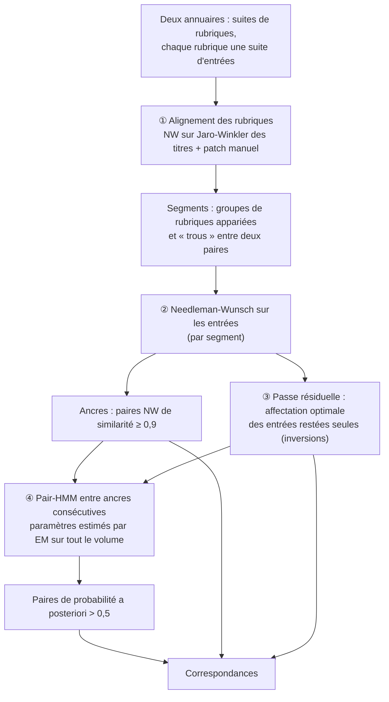

# Aligner deux éditions d'un annuaire ancien en exploitant l'ordre des entrées

*Document de travail — chaîne de traitement des annuaires parisiens du début du XIXᵉ siècle (`align_directories_nw.py`). Version du 29 septembre 2026.*

---

**Résumé.** Nous voulons retrouver, d'une édition d'un annuaire à la suivante, les entrées qui décrivent la même personne ou le même commerce. La méthode en place (Dedupe) apprend une fonction de ressemblance à partir de paires étiquetées, mais ignore une information essentielle : **l'ordre des entrées**. D'une édition à l'autre, rubriques et entrées se suivent presque dans le même ordre. Nous proposons une méthode sans apprentissage supervisé, en quatre étapes :

1. aligner les rubriques ;
2. aligner les entrées de chaque rubrique par programmation dynamique (Needleman-Wunsch) ;
3. rattraper les inversions locales par une affectation optimale ;
4. arbitrer les cas douteux par un modèle de Markov caché d'alignement (*pair-HMM*). Ce modèle exprime formellement l'intuition qu'une paire encadrée par deux paires sûres est plus probable qu'une paire isolée.

Les paramètres du modèle sont estimés sans étiquettes. Sur les éditions 1807 et 1808 (17 388 et 16 093 entrées), la méthode apparie 14 491 entrées en 12 secondes. Elle partage 13 187 paires avec Dedupe. Faute de vérité de référence, ces chiffres ne mesurent pas encore la qualité : ils décrivent le comportement de la méthode en attendant un corpus d'évaluation.

---

## 1. Introduction

### 1.1 Le problème

Un annuaire du début du XIXᵉ siècle est une suite de **rubriques** (« Agens de change », « Bouchers », « Liste des non-commerçans »…). Chaque rubrique contient une suite d'**entrées** du type :

> Pagès, rue de l'Échiquier, 33.

Chaque entrée a été segmentée et annotée en amont : nom (SUBJ), description (DESC) et adresse (ADDR). Pour suivre les personnes et les commerces dans le temps, il faut **apparier** les entrées de deux éditions successives. Chaque entrée a au plus un correspondant, et beaucoup n'en ont pas : décès, départs, nouveaux venus.

La difficulté tient à la variabilité des textes : erreurs d'OCR, graphies changeantes (« Guéniot » / « Gueniot »), abréviations (« S.-Martin » / « Saint-Martin ») et surtout **déménagements**. La même personne peut changer entièrement d'adresse d'une année sur l'autre. À l'inverse, deux homonymes (« Dupont ») peuvent se ressembler beaucoup.

### 1.2 Pourquoi l'ordre

Un annuaire est trié : les rubriques par ordre alphabétique, puis les entrées au sein de chaque rubrique. Ce tri est un indice précieux. Si « Mounier » et « Péan de Saint-Gilles » se correspondent d'une édition à l'autre, ce qui se trouve **entre** eux doit aussi, probablement, se correspondre. C'est l'information que la méthode actuelle, Dedupe, laisse de côté : elle compare les entrées deux à deux, indépendamment de leur position.

### 1.3 Contributions

1. Un alignement ordonné, à deux niveaux (rubriques puis entrées), sans phase d'étiquetage.
2. Une formalisation probabiliste du contexte d'ordre par un pair-HMM. On obtient ainsi pour chaque paire une **probabilité a posteriori**, directement interprétable.
3. Une procédure d'estimation non supervisée des paramètres, qui évite un piège d'identifiabilité rencontré en pratique.
4. Une correspondance des rubriques corrigeable à la main (patch). Elle est partagée avec Dedupe et l'outil de relecture.

---

## 2. Données et observations préliminaires

Les données sont les éditions 1807 et 1808 (AD75, PER 292), segmentées en entrées et annotées. Les observations ci-dessous portent sur les 13 582 liens produits par Dedupe, faute de mieux.

| | 1807 | 1808 |
|---|---|---|
| entrées | 17 388 | 16 093 |
| rubriques | 146 | 154 |

- **O1 — l'ordre des rubriques est stable.** Chaque rubrique forme un bloc contigu. L'ordre des rubriques appariées ne présente aucune inversion.
- **O2 — les titres de rubrique varient** : « Liste » / « Listes de non-commerçans », « Sellieres » / « Selliers », « fabr. » / « fab. ». Une comparaison exacte des titres échoue pour 20 % des liens.
- **O3 — l'ordre des entrées est presque stable.** La plus longue sous-suite croissante contient 96 % des liens Dedupe. Les exceptions sont surtout de petites inversions du tri alphabétique.
- **O4 — les « trous » 1×1 sont fréquents.** Il s'agit d'une seule entrée non appariée de chaque côté, entre deux paires. On en compte 374. Leurs similarités sont bimodales : autour de 0,65–0,75, ce sont surtout des personnes qui ont déménagé ; plus bas, surtout des **remplacements** (une entrée disparaît, une autre apparaît au même rang).

---

## 3. Vue d'ensemble de la méthode



```text
Algorithme 1 — alignement ordonné de deux annuaires A et B
  entrée : A, B (suites de rubriques), patch des rubriques P
  sortie : ensemble de paires (a, b), chacune avec sa source et son score

  1  G ← AlignerRubriques(A, B, P)                     § 4.2
  2  pour chaque segment (Sa, Sb) de G :                 § 4.2
  3      S ← matrice de similarité des entrées de Sa × Sb  § 4.1
  4      N ← NeedlemanWunsch(S, τ = 0,75)                 § 4.3
  5      R ← Résiduelle(S, entrées hors N, θr = 0,85)     § 4.4
  6      Ancres ← { (i, j) ∈ N : S[i, j] ≥ 0,9 }
  7      Fenêtres ← entrées entre deux ancres consécutives, hors R
  8  θ ← EM(toutes les fenêtres)                          § 4.5.4
  9  pour chaque fenêtre W :
 10      C ← { (i, j) ∈ W : P(i ↔ j | W ; θ) > 1/2 }      § 4.5.3
 11  retourner Ancres ∪ C ∪ R
```

Chaque étape est présentée ci-dessous en trois temps : l'intuition, le concept, puis sa formalisation.

---

## 4. Méthode

### 4.1 Similarité entre deux entrées

**Intuition.** Deux entrées se ressemblent d'abord par le nom, puis par le reste du texte. Le nom est court, il ouvre l'entrée, et ses variantes touchent surtout la fin (« Péan de Saint-Gilles » / « Péan-de-Saint-Gille »).

**Concept.** On combine deux mesures classiques :
- la similarité de **Jaro-Winkler**, qui favorise un début de chaîne commun et convient aux noms ;
- une **distance d'édition** normalisée, pour le texte complet, long et dont l'adresse varie.

On utilise les mêmes champs que Dedupe, en minuscules.

**Formalisation.** Pour deux entrées $a$ et $b$ :

$$
s(a,b) \;=\; w\,\mathrm{JW}(\mathrm{subj}_a,\mathrm{subj}_b) \;+\; (1-w)\,\mathrm{Indel}(\mathrm{text}_a,\mathrm{text}_b), \qquad w = 0{,}5,
$$

où $\mathrm{Indel}(x,y) = 1 - d_{\mathrm{indel}}(x,y)/(|x|+|y|)$. Si l'un des deux SUBJ est vide, $s = \mathrm{Indel}$. On a $s \in [0,1]$.

### 4.2 Alignement des rubriques

**Intuition.** Les rubriques se suivent dans le même ordre d'une édition à l'autre, avec quelques ajouts et suppressions et des titres légèrement variables. On les aligne comme on aligne deux listes presque identiques. Le résultat découpe le problème en **segments**, petits et indépendants.

**Concept.** On aligne les deux suites de rubriques par programmation dynamique (§ 4.3), sur la similarité Jaro-Winkler des titres normalisés, avec un seuil de 0,8. Ce qui échappe à l'ordre se corrige dans un **patch** édité à la main :
- une rubrique déplacée dans l'ordre alphabétique : « Jardiniers-fleuristes, marchands d'arbres » → « Marchands d'arbres » ;
- une rubrique éclatée : « Académie de médecine » → « Administrateurs », « Commission des travaux », « Commission des consultations ».

**Formalisation.** Le patch est un graphe biparti $\mathcal{P}$ entre rubriques de gauche et de droite, désignées par l'uuid de leur titre.
- Ses **composantes connexes** définissent des groupes $g = (L_g, R_g)$, de cardinalités quelconques (1-1, 1-N, N-M).
- Une rubrique peut aussi être déclarée sans correspondance.
- Les rubriques citées par le patch sont retirées des deux suites, qu'on aligne ensuite automatiquement.

Les **segments** sont de trois sortes :
- les groupes manuels, dont les entrées de toutes les rubriques sont concaténées dans l'ordre de chaque annuaire ;
- les paires automatiques ;
- les « trous » entre deux paires automatiques consécutives, qui regroupent les rubriques restées seules de part et d'autre, à condition qu'il y en ait des deux côtés.

Sur 1807/1808 : 144 paires automatiques (dont 12 de titres différents), 2 groupes manuels (1-1 et 1-3), 6 rubriques sans correspondance, toutes en 1808.

*Usage partagé.* Dedupe compare la rubrique comme une chaîne. Pour qu'il profite de cette correspondance, chaque rubrique reçoit une **clé canonique** : celle de la première rubrique de gauche de son groupe. La même réécriture s'applique aux paires d'entraînement déjà étiquetées. L'outil de relecture, lui, signale les paires dont les rubriques ne se correspondent pas.

### 4.3 Alignement ordonné des entrées : Needleman-Wunsch

**Intuition.** On lit les deux listes d'un même segment en parallèle, comme deux personnes qui pointent la même liste d'invités. À chaque pas, on apparie les deux entrées courantes ou on saute l'une d'elles. On cherche le parcours qui apparie le plus d'entrées ressemblantes, **sans jamais revenir en arrière**.

**Concept.** C'est l'algorithme de Needleman et Wunsch (1970), conçu pour aligner des séquences biologiques. Chaque paire rapporte « sa similarité moins un seuil ». Sauter une entrée ne coûte rien : une paire sous le seuil n'est jamais retenue.

**Formalisation.** Pour un segment de matrice de similarité $S \in [0,1]^{n\times m}$, on cherche l'appariement croissant $\pi = \{(i_1,j_1),\dots\}$, avec $i_1<i_2<\cdots$ et $j_1<j_2<\cdots$, qui maximise

$$
\sum_{(i,j)\in\pi} \big(S_{ij}-\tau\big), \qquad \tau = 0{,}75,
$$

par la récurrence

$$
H_{i,j} = \max\big(H_{i-1,j},\; H_{i,j-1},\; H_{i-1,j-1} + S_{ij} - \tau\big), \qquad H_{0,\cdot}=H_{\cdot,0}=0.
$$

Sans pénalité de trou, la ligne $i$ se calcule en vectorisé : on prend le maximum avec la diagonale, puis le maximum cumulé. Le coût est $O(nm)$ en temps et en mémoire.

**Limite.** La décision est locale et à seuil fixe. Chez les agents de change, Pagès est rue de l'Échiquier en 1807 et boulevard Montmartre en 1808 : $s = 0{,}742 < \tau$, donc la paire est rejetée. Pourtant, ses deux voisins sont appariés des deux côtés. Pour Needleman-Wunsch, « un Pagès disparaît et un autre apparaît exactement au même rang » ne coûte rien.

### 4.4 Inversions locales : passe résiduelle

**Intuition.** Un appariement croissant ne peut pas représenter deux entrées qui ont échangé leurs places (tri instable : « Aubert » / « Aubry », homonymes). On les récupère après coup, parmi les entrées restées seules, à condition qu'elles se ressemblent beaucoup.

**Formalisation.** Soient $I$ et $J$ les lignes et colonnes absentes de l'appariement $N$ de Needleman-Wunsch. On résout le problème d'affectation

$$
\max_{x \in \{0,1\}^{I\times J}} \sum_{i,j} x_{ij}\,\tilde S_{ij}
\quad \text{s.c.}\quad \textstyle\sum_j x_{ij}\le 1,\; \sum_i x_{ij}\le 1,
\qquad \tilde S_{ij} = S_{ij}\,\mathbb 1[S_{ij}\ge \theta_r],\; \theta_r = 0{,}85,
$$

avec l'algorithme de Jonker-Volgenant (`scipy.optimize.linear_sum_assignment`). Sur 1807/1808, on obtient 401 paires.

### 4.5 Le contexte d'ordre : un pair-HMM

#### 4.5.1 Intuition

Revenons à Pagès. Deux histoires expliquent ce qu'on observe entre Mounier et Péan :

- **(a)** c'est le même Pagès, qui a déménagé ;
- **(b)** un Pagès a disparu et un autre Pagès est apparu, par coïncidence, exactement au même rang.

Prise isolément, une similarité de 0,742 penche plutôt pour « deux personnes différentes ». Mais l'histoire (b) exige deux événements rares au même endroit. Pour trancher, il faut **peser la ressemblance contre la rareté des événements**. C'est ce que fait un modèle probabiliste de l'alignement.

#### 4.5.2 Concept

Un alignement se lit comme une suite d'**événements** : « paire » (M), « entrée seulement à gauche » (X, supprimée), « entrée seulement à droite » (Y, ajoutée). On modélise :

- la **fréquence des événements** : une chaîne de Markov sur $\{M,X,Y\}$. Par exemple, après une paire, une autre paire suit dans 77 % des cas ;
- la **ressemblance des paires** : le rapport entre la probabilité d'observer cette similarité pour une même entrée et celle de l'observer pour deux entrées différentes. C'est le **rapport de vraisemblance** du modèle de Fellegi et Sunter (1969), fondement du *record linkage*.

On fait alors la somme sur **tous** les alignements possibles, et pas seulement sur le meilleur. On obtient pour chaque paire candidate sa **probabilité a posteriori** : la part des explications plausibles qui l'incluent.

#### 4.5.3 Formalisation

On suit Durbin et al. (1998, ch. 4).

**Modèle.** Il comporte :
- des états $\{M, X, Y\}$ ;
- une matrice de transition $T$ avec $T_{YX}=0$, pour qu'un trou mixte n'ait qu'une seule écriture : les suppressions avant les ajouts ;
- une émission de paire égale au rapport de vraisemblance :

$$
\lambda(s) = \frac{p(s \mid \text{même entrée})}{p(s \mid \text{entrées différentes})},
$$

avec $s$ discrétisée en 20 classes. $X$ et $Y$ émettent $1$ : c'est le « modèle nul » de Durbin, où tout est rapporté à l'hypothèse d'indépendance.

**Fenêtres.** On conditionne sur les **ancres**, les paires de Needleman-Wunsch avec $s \ge 0{,}9$ (11 820 paires). Le modèle ne s'applique qu'aux **fenêtres** situées entre deux ancres consécutives, dont on retire les paires de la passe résiduelle. Une fenêtre de taille $k\times l$, de similarités $S$, commence en $M$ et se termine par une transition vers $M$.

**Forward.** On part de $f^M_{0,0}=1$ :

$$
\begin{aligned}
f^M_{i,j} &= \lambda(S_{ij}) \textstyle\sum_{u} f^u_{i-1,j-1}\,T_{uM},\\
f^X_{i,j} &= \textstyle\sum_{u} f^u_{i-1,j}\,T_{uX},\qquad
f^Y_{i,j} = \textstyle\sum_{u} f^u_{i,j-1}\,T_{uY},\\
Z &= \textstyle\sum_u f^u_{k,l}\,T_{uM}.
\end{aligned}
$$

La récurrence **backward** $b^u_{i,j}$ est symétrique. Tous les calculs se font en espace logarithmique.

**Décision.** La probabilité a posteriori d'une paire est

$$
P(i \leftrightarrow j \mid S) = \frac{f^M_{i,j}\, b^M_{i,j}}{Z}.
$$

On retient les paires telles que $P > 1/2$. Chaque ligne et chaque colonne a une somme de probabilités au plus égale à 1. Ces paires sont donc au plus une par entrée, et elles forment toujours un alignement croissant (Miyazawa 1995 ; Holmes & Durbin 1998). Le score exporté pour ces paires (source `nw-contexte`) est $P$.

**Retour sur Pagès.** La fenêtre est de taille 1×1, et seuls deux chemins existent : $M$, ou $X$ puis $Y$. Avec les paramètres estimés (§ 4.5.4) :

$$
P = \frac{T_{MM}^2\,\lambda(0{,}742)}{T_{MM}^2\,\lambda(0{,}742) + T_{MX}T_{XY}T_{YM}}
  = \frac{0{,}774^2 \times e^{-2{,}34}}{0{,}774^2 \times e^{-2{,}34} + 0{,}161\times0{,}152\times0{,}870}
  \approx 0{,}73.
$$

La **cote a priori** du contexte, $T_{MM}^2/(T_{MX}T_{XY}T_{YM}) \approx 28$, l'emporte sur un rapport de vraisemblance défavorable, $\lambda \approx 0{,}1$.

Deux contrôles :
- une paire vraiment dissemblable ($s\approx0{,}4$, $\lambda\approx e^{-6}$) n'est jamais sauvée par le contexte ;
- la même paire au milieu d'un large trou (plusieurs ajouts et suppressions autour) ne bénéficie pas de cette cote.

#### 4.5.4 Estimation des paramètres sans étiquettes

**Émissions : estimées hors contexte, puis fixées.**

- $p(s\mid\text{différentes})$ : histogramme des similarités entre chaque ancre $(i,j)$ et les **voisins** de son partenaire, $(i, j\pm d)$ et $(i\pm d, j)$ pour $d\le3$. C'est le bon modèle nul pour une paire candidate au sein d'une fenêtre : dans une liste alphabétique, deux voisines partagent souvent leurs initiales. Des paires tirées au hasard dans la rubrique se ressembleraient bien moins et **gonfleraient** $\lambda$.
- $p(s\mid\text{même})$ : histogramme des paires dont le **SUBJ est identique et unique** des deux côtés du segment (≈ 9 000 paires). Elles sont choisies sans regarder ni l'ordre ni la similarité. Comme un SUBJ identique garantit $s\ge0{,}5$, l'échantillon est biaisé vers le haut. Le biais est **conservateur** : il sous-estime les vraies paires peu similaires.
- Deux traitements complètent l'estimation. Un lissage vers $p(s\mid\text{différentes})$ donne $\lambda=1$ dans une classe vide. Puis une contrainte de **rapport de vraisemblance monotone** impose $\lambda$ non décroissant, par $\tilde\lambda(b)=\min_{b'\ge b}\lambda(b')$ : une similarité plus haute n'est jamais un indice plus faible. Le rapport devient favorable ($\lambda > 1$) à partir de $s\approx0{,}80$.

**Transitions : EM (Baum-Welch)** sur l'ensemble des fenêtres du volume. Soit $N_{uv}$ le nombre attendu de transitions $u\to v$ sous le modèle courant, obtenu par forward-backward. La mise à jour, avec un lissage de Laplace, est

$$
T_{uv} \leftarrow \frac{N_{uv}+1}{\sum_{v'} (N_{uv'}+1)} \quad (v \text{ admissible}).
$$

On itère jusqu'à ce que le gain de log-vraisemblance soit inférieur à 1 nat. Sur 1807/1808, cela prend 4 itérations :

| de \ vers | M | X | Y |
|---|---|---|---|
| M | 0,774 | 0,161 | 0,065 |
| X | 0,635 | 0,213 | 0,152 |
| Y | 0,870 | — | 0,130 |

**Un piège d'identifiabilité.** Une première version laissait l'EM estimer aussi $p(s\mid\text{même})$. Elle convergeait vers une solution dégénérée. Les remplacements au même rang (« Helger » → « Hermée ») étaient expliqués comme des paires, ce qui augmentait $p(s\mid\text{même})$ autour de 0,5, ce qui en faisait accepter d'autres, et ainsi de suite. Avec des émissions libres, le mélange « même / différentes » n'est pas identifiable à partir des seules fenêtres. Fixer les émissions sur des échantillons indépendants du contexte rompt cette boucle.

---

## 5. Mise en œuvre

| paramètre | valeur | rôle |
|---|---|---|
| $w$ | 0,5 | poids du SUBJ dans $s$ |
| seuil des rubriques | 0,8 | Jaro-Winkler minimal entre deux titres |
| $\tau$ | 0,75 | seuil de Needleman-Wunsch |
| seuil des ancres | 0,9 | paires tenues pour sûres |
| $\theta_r$ | 0,85 | seuil de la passe résiduelle |
| classes de $s$ | 20 | discrétisation des émissions |

- **Complexité.**
  - Needleman-Wunsch est quadratique par segment ; la plus grande rubrique compte 3 277 × 2 702 entrées.
  - Le pair-HMM ne porte que sur les fenêtres entre ancres, soit environ 8 000 cases au total.
  - Le script complet tourne en 12 s, dont 4 s pour l'alignement lui-même.
- **Code.**
  - `align_directories_nw.py` : le script ; `--no-context` désactive le pair-HMM.
  - `lib/section_alignment.py` : l'alignement des rubriques et son patch.
  - `lib/sequence.py` : Needleman-Wunsch.
  - `lib/pair_hmm.py` : le pair-HMM.
- **Sortie.** Le résultat est `annuaires/alignements/<A>__<B>.nw.csv`, au format de la sortie Dedupe. La colonne `source` vaut `nw` pour une ancre, `nw-contexte` pour une paire décidée par le pair-HMM (score = probabilité a posteriori) et `nw-residuel` pour une paire de la passe résiduelle.

---

## 6. Résultats préliminaires (1807 → 1808)

Il n'existe pas encore de vérité de référence. Les chiffres ci-dessous décrivent le comportement des méthodes, pas leur exactitude. Les deux variantes de Dedupe diffèrent par la comparaison des rubriques : titres bruts, ou clé canonique de groupe (§ 4.2). Chacune correspond à une seule exécution, et l'entraînement de Dedupe comporte une part d'aléa.

| méthode | paires | entre rubriques non correspondantes | communes avec NW + pair-HMM |
|---|---|---|---|
| Needleman-Wunsch seul | 14 355 | 0 | 14 320 |
| **NW + pair-HMM** | **14 491** | 0 | — |
| Dedupe, rubriques brutes | 13 582 | 16 | 13 187 |
| Dedupe, clé canonique | 13 213 | 8 | 12 875 |

Répartition des 14 491 paires : 11 820 ancres, 2 270 paires décidées par le pair-HMM et 401 inversions.

Lecture qualitative d'un échantillon :

- **Gains du pair-HMM** (171 paires par rapport à NW seul) : surtout des déménagements (Pagès *p* = 0,73, Rey, Morlot, Maradan, Seguin). Deux permutations d'homonymes sont aussi corrigées (Renard, Marchais).
- **Paires retirées** (35) : surtout des homonymes fréquents dont l'adresse a changé (Lambert, Gervais, Lemaire). Le modèle les juge ambiguës.
- **Erreurs résiduelles visibles** : quelques remplacements acceptés (Potrel → Prot, *p* = 0,57).

### 6.1 Évaluation de la passe résiduelle sur un gold d'inversions

Un collègue a objecté que l'affectation optimale « force » des appariements
et que son seuil conservateur perd des entrées déplacées qui ont aussi changé
d'adresse. Une note de travail proposait de pénaliser le déplacement, dans
Needleman-Wunsch et dans le HMM. Pour trancher, nous avons étiqueté un **gold
d'inversions** (`tools/sample_alignment_gold.py`). Il regroupe 216 paires
candidates hors de l'ordre, tirées par strate (déplacement × similarité),
chacune avec son poids : 105 `OUI`, 90 `NON` et 21 `INCERTAIN`.

| indice | OUI | NON | INCERTAIN |
|---|---|---|---|
| $s \ge 0{,}85$ | 93 | 5 | 6 |
| $0{,}75 \le s < 0{,}85$ | 10 | 34 | 12 |
| $s < 0{,}75$ | 2 | 51 | 3 |
| meilleures partenaires mutuelles dans le segment | 104 | 13 | 13 |
| pas meilleures partenaires mutuelles | 1 | 77 | 8 |

- **La règle actuelle est précise.** En pondérant, elle retient environ 374
  `OUI` pour 16 `NON` et 12 `INCERTAIN`, soit 93 % de précision.
- **Le gain possible est plafonné, et il ne peut pas être automatisé.**
  - Parmi les candidates rejetées, on estime environ 66 `OUI` et 72
    `INCERTAIN` pour environ 1 700 `NON`, soit au mieux 0,5 % de paires en
    plus.
  - Ces `OUI` se trouvent dans la zone 0,75–0,85, chez des meilleures
    partenaires mutuelles. On y compte en pondéré 28 `OUI`, 42 `NON` et 18
    `INCERTAIN` : une acceptation automatique ferait plus de fausses paires
    que de bonnes.
  - Les notes d'étiquetage montrent pourquoi. Pour trancher, il faut un
    savoir que les données n'ont pas : homonymes, père et fils, femme et
    mari, coquilles des éditeurs, rues renommées.
- **Le déplacement n'est pas informatif.**
  - D'une classe de déplacement à l'autre, la part de `OUI` reste voisine
    de 50 %.
  - Rapporté à la taille de la rubrique, il ne sépare rien non plus.
  - Une longue rubrique (« Non-commerçans ») déplace loin une entrée dont le
    nom a été mal recopié.
  - Pénaliser le déplacement n'aurait donc rien apporté.
- **Trois estimations non supervisées d'un a priori par classe de
  déplacement ont échoué.**
  - L'échantillon à SUBJ identique et unique manque les entrées déplacées,
    qui le sont surtout parce que leur nom a changé de graphie.
  - Laisser l'EM apprendre $p(s\mid\text{différentes})$ fait diverger
    l'estimation, comme au § 4.5.4.
  - L'estimateur des moments hérite du biais de $p(s\mid\text{même})$.

**Conclusion.** La passe résiduelle reste à seuil fixe. Les cas douteux
sont signalés pour une **relecture humaine ciblée**
(`lib/alignment_review.py`, voir `docs/pipeline.md`).
- Trois motifs : `déduite des voisines (p < 0,9)`, `homonyme proche` et `candidate non appariée`.
- Une incertitude ordinale : faible, moyenne ou forte.
- Les décisions sont reportées dans le patch des entrées, avec un statut
  `incertaine` pour ce qui ne peut pas être tranché.

Sur ce gold, la part de `OUI` (pondérée) baisse bien de l'incertitude
faible à forte : 94 %, 75 %, 31 %. Il reste à vérifier 445 lignes sur 14 491 paires. Ces chiffres
sont des **observations sur 1807/1808**. Pour une autre paire d'annuaires,
on tire un petit gold et on lance `tools/audit_alignment_review.py` avant de
se fier aux seuils.

---

## 7. Discussion

- **Hypothèses.**
  - La probabilité a posteriori est **conditionnelle aux ancres** : une ancre erronée fausse les fenêtres voisines.
  - Les inversions sont traitées hors modèle, par la passe résiduelle. Le gold du § 6.1 montre qu'une règle plus fine ne paierait pas : les cas manqués relèvent de la relecture humaine.
  - Les émissions reposent sur deux échantillons choisis par heuristique (SUBJ uniques, voisins d'ancres). Leurs biais sont connus mais pas quantifiés.
- **Ce que l'ordre apporte et ce qu'il n'apporte pas.**
  - L'ordre tranche efficacement entre « déménagement » et « remplacement » lorsque le reste de la rubrique est stable.
  - Il n'aide pas pour les homonymes voisins dans l'ordre alphabétique, ni pour les rubriques remaniées, qui relèvent alors du patch.
- **Complémentarité avec Dedupe.**
  - Dedupe apprend une ressemblance plus riche, mais ignore l'ordre.
  - La méthode proposée exploite l'ordre avec une ressemblance simple.
  - Une combinaison naturelle serait d'utiliser la probabilité Dedupe comme émission du pair-HMM, à la place de $\lambda(s)$.
- **Calibration.** Le score $P$ est une probabilité au sens du modèle. Sa calibration réelle reste à vérifier.

## 8. Perspectives

1. **Évaluation.** Constituer un échantillon de référence, stratifié par rubrique et par type de cas (trou 1×1, homonymes, inversions). Mesurer précision, rappel et calibration des quatre variantes du tableau de la section 6. Les inversions sont faites (§ 6.1). Restent les paires du pair-HMM, dont le motif `déduite des voisines` n'est pas encore évalué.
2. **Sensibilité.** Étudier l'effet du seuil des ancres, de $w$ et du nombre de classes.
3. **Émissions multivariées.** Séparer nom et adresse dans $\lambda$, par exemple avec un modèle de Fellegi-Sunter à deux champs.
4. **Plus de deux éditions.** Enchaîner les alignements 1803 → 1804 → … et contrôler leur cohérence transitive.

## Références

- Durbin R., Eddy S., Krogh A., Mitchison G. (1998). *Biological Sequence Analysis: Probabilistic Models of Proteins and Nucleic Acids*, ch. 4. Cambridge University Press.
- Fellegi I. P., Sunter A. B. (1969). A theory for record linkage. *JASA* 64(328), 1183–1210.
- Needleman S. B., Wunsch C. D. (1970). A general method applicable to the search for similarities in the amino acid sequence of two proteins. *J. Mol. Biol.* 48(3), 443–453.
- Miyazawa S. (1995). A reliable sequence alignment method based on probabilities of residue correspondences. *Protein Engineering* 8(10), 999–1009.
- Holmes I., Durbin R. (1998). Dynamic programming alignment accuracy. *J. Comput. Biol.* 5(3), 493–504.
- Dempster A. P., Laird N. M., Rubin D. B. (1977). Maximum likelihood from incomplete data via the EM algorithm. *JRSS B* 39(1), 1–38.
- Winkler W. E. (1990). String comparator metrics and enhanced decision rules in the Fellegi-Sunter model of record linkage. *Proc. Section on Survey Research Methods*, ASA.
- Crouse D. F. (2016). On implementing 2D rectangular assignment algorithms. *IEEE Trans. Aerospace and Electronic Systems* 52(4), 1679–1696.
- Gregg F., Eder D. (2022). *Dedupe* (logiciel), https://github.com/dedupeio/dedupe.
