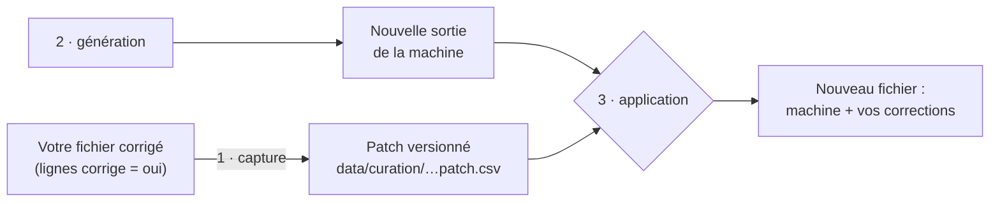

# Guide de la curation : corriger sans jamais perdre ses corrections

Ce guide s'adresse à toute personne qui corrige à la main les résultats de
la chaîne de traitement. Aucune connaissance du code n'est nécessaire. Le
détail technique est dans [`pipeline.md`](pipeline.md#corrections-humaines-rejouables--libcurationpy)
et dans `lib/curation.py`.

## Le problème qu'on résout

La chaîne transforme un annuaire scanné en données, étape par étape. Les
machines (OCR, CRF, modèle NER) se trompent parfois. On corrige donc leurs
résultats à la main.

Mais les machines s'améliorent : un meilleur CRF, un nouveau modèle NER…
On veut alors **relancer la chaîne** pour profiter des progrès sur tout ce
qu'on n'a pas encore relu, **sans perdre une seule correction** déjà faite.

Le principe tient en une phrase :

> **Vous corrigez directement le fichier produit, vous marquez la ligne
> `corrige = oui`, et le script s'en souviendra à chaque relance.**

## Les trois colonnes à connaître

Chaque fichier qu'on peut corriger contient, en plus de ses données, trois
colonnes spéciales :

| Colonne | À quoi elle sert | Faut-il y toucher ? |
|---|---|---|
| la **clé** (`cle` pour les lignes, `uuid` pour les entrées) | Le « numéro de sécurité sociale » de la ligne : il ne change jamais d'une relance à l'autre, même si on ajoute des pages au PDF. | **Non**, jamais. |
| `corrige` | Votre signature : `oui` veut dire « un humain a vérifié cette ligne, ne pas y toucher ». | **Oui** : c'est la seule chose à ne pas oublier. |
| `empreinte` | Le « sceau » posé par la machine sur ses propres valeurs. Il sert à repérer une ligne modifiée qu'on aurait oublié de signer. | **Non**, jamais. |

Mettre `corrige = oui` sert aussi quand on **valide une ligne sans la
modifier** : confirmer que la machine a raison est une décision humaine
qu'on veut garder.

## Ce qui se passe quand on relance un script



1. **Capture.** Le script relit votre fichier et recopie toutes les lignes
   `corrige = oui` dans un petit fichier à part, le **patch**, rangé dans
   `data/curation/` et suivi par git.
2. **Génération.** La machine refait son travail.
3. **Application.** Vos corrections sont reposées par-dessus. **Le patch
   gagne toujours** sur la machine.

Le script **réussit entièrement ou n'écrit rien**. S'il a le moindre doute,
il s'arrête et vous explique pourquoi (voir
[Quand le script s'arrête](#quand-le-script-sarrête)).

## Corriger les lignes (étape 3)

**Fichier :** `annuaires/<volume>/<plage>/<…>.ocr.lines.annotated.csv`
**Script à relancer :** `uv run export_lines_csv.py <…>.ocr.lines.annotated.json --apply` (sans `--apply` : simulation, qui montre les conflits sans rien écrire)
**Patch :** `data/curation/<volume>.<plage>.lignes.patch.csv`

On y corrige deux colonnes : `classe` (le type de ligne : `B-ENTRY`,
`I-ENTRY`, `SUB-ENTRY`, `B-TITLE`, `I-TITLE`, `OUT OF SCOPE`) et
`markdown` (le texte, y compris les `#` qui donnent le niveau d'un titre).

Dans les exemples qui suivent, on ne montre que les colonnes utiles.

### Changer une classe

La machine a pris une suite de ligne pour une nouvelle entrée :

| cle | markdown | classe | corrige |
|---|---|---|---|
| `a1f…` | `Badet, rue Helvétius, 37.` | `B-ENTRY` | |
| `c7e…` | `et cartier` | ~~`B-ENTRY`~~ → **`I-ENTRY`** | **`oui`** |

### Corriger un texte ou un niveau de titre

| cle | markdown | classe | corrige |
|---|---|---|---|
| `05b…` | ~~`#### PAPETIERS.`~~ → **`## PAPETIERS.`** | `B-TITLE` | **`oui`** |

### Valider sans rien changer

La ligne est juste, mais on veut la protéger d'un futur CRF qui se
tromperait :

| cle | markdown | classe | corrige |
|---|---|---|---|
| `9d2…` | `Auzou, rue de la Verrerie, 101.` | `B-ENTRY` | **`oui`** |

### Supprimer une ligne

**On n'efface jamais une ligne du fichier.** On lui donne la classe
`SUPPRIMÉE` (avec l'accent) : elle reste visible, mais l'étape suivante
l'ignore.

| cle | markdown | classe | corrige |
|---|---|---|---|
| `3b8…` | `218` (numéro de page en double) | **`SUPPRIMÉE`** | **`oui`** |

C'est ainsi qu'on retire, par exemple, des pages scannées deux fois.

### Ajouter une ligne

On insère une ligne à l'endroit voulu et on **laisse sa clé vide**. Au
prochain lancement, le script lui donne une clé dérivée de la ligne
précédente (`a1f…+1`) et retiendra sa place.

| cle | markdown | classe | corrige |
|---|---|---|---|
| `9d2…` | `Auzou, rue de la Verrerie, 101.` | `B-ENTRY` | |
| *(vide)* → `9d2…+1` | **`Auzou fils, rue d'Anjou, 21.`** | **`B-ENTRY`** | *(mis à `oui` automatiquement)* |

### Couper une ligne en deux (dupliquer)

Une ligne contient deux entrées collées par l'OCR ? On copie la ligne
juste en dessous (la copie a donc la même clé), puis on répartit le texte :

| cle | markdown | classe | corrige |
|---|---|---|---|
| `e40…` | ~~`Boulanger, rue St.-Benoit, 19. Boulanger (Ve.), rue Vivienne, 22.`~~ → **`Boulanger, rue St.-Benoit, 19.`** | `B-ENTRY` | **`oui`** |
| `e40…` → `e40…+1` | **`Boulanger (Ve.), rue Vivienne, 22.`** | `B-ENTRY` | *(automatique)* |

Le script repère la clé en double et en donne une nouvelle à la copie.

### Déplacer une ligne (ordre de lecture)

L'OCR lit parfois deux colonnes dans le mauvais ordre. **On ne coupe-colle
pas** une ligne : l'ordre des lignes de la machine est celui de l'OCR et doit
le rester. On fait en deux gestes :

1. l'originale reçoit la classe `SUPPRIMÉE` (et `corrige = oui`) ;
2. on insère une copie à la bonne place et on **vide sa colonne `cle`**
   (une copie qui garderait la clé de l'originale serait prise pour la
   ligne machine elle-même, déplacée).

| cle | markdown | classe | corrige |
|---|---|---|---|
| `05b…` | `## PAPETIERS.` | **`SUPPRIMÉE`** | **`oui`** |
| … | *(le bloc qui devait venir avant)* | … | |
| *(vide)* | `## PAPETIERS.` | `B-TITLE` | |

Pour un bloc entier, on fait de même ligne par ligne : toutes les
originales en `SUPPRIMÉE`, toutes les copies sans clé.

## Corriger le NER et les rubriques (étape 5)

**Fichier :** `annuaires/<volume>/<plage>/<…>.ocr.lines.annotated.merged.ner.csv`
**Script à relancer :** `uv run infer_gliner.py <…>.merged.csv --model <modèle> --apply`
**Patch :** `data/curation/<volume>.<plage>.ner.patch.csv`

Chaque ligne du fichier est une **entrée** (ou un titre). On y corrige
deux colonnes :

- `tagged_text` : le découpage en `SUBJ` (qui ?), `DESC` (quoi ?) et `ADDR`
  (où ?), selon le [guide d'annotation](guide_annotation_ner.md) ;
- `parent_uuid` : l'`uuid` du titre de la rubrique à laquelle l'entrée
  appartient.

### Corriger un découpage

| uuid | markdown | tagged_text | corrige |
|---|---|---|---|
| `7c1…` | `Badet, *et cartier*, rue Helvétius, 37.` | ~~`<SUBJ>Badet, *et cartier*</SUBJ>, <ADDR>rue Helvétius, 37</ADDR>.`~~ → **`<SUBJ>Badet</SUBJ>, <DESC>*et cartier*</DESC>, <ADDR>rue Helvétius, 37</ADDR>.`** | **`oui`** |

Seules les balises changent : le texte entre les balises doit rester
exactement celui de la colonne `markdown`.

### Rattacher une entrée à une autre rubrique

On remplace son `parent_uuid` par l'`uuid` de la bonne ligne de titre
(colonne `uuid` d'une ligne `TITLE` du même fichier) :

| uuid | entity | markdown | parent_uuid | corrige |
|---|---|---|---|---|
| `2aa…` | `TITLE` | `## PAPETIERS.` | … | |
| `7c1…` | `ENTRY` | `Badet, …` | ~~`91f…`~~ → **`2aa…`** | **`oui`** |

Les nombres d'empans (`subject_count`…) sont recalculés automatiquement
sur les lignes corrigées.

## Corriger l'alignement entre éditions (étape 6)

Ici on ne corrige pas un gros fichier : on écrit directement les décisions
dans les patchs `data/alignement/<A>__<B>.patch.csv` (entrées) et
`.sections.csv` (rubriques), en s'aidant des boutons « copier » du viewer
(`tools/display_alignment.py`). Les conventions sont dans le
[guide de relecture de l'alignement](guide_relecture_alignement.md).

Les règles sont les mêmes qu'ailleurs : le patch gagne sur la machine, et
le script s'arrête si une ligne du patch ne correspond plus à rien.

## Quand le script s'arrête

Le script affiche `✋ Arrêt, rien n'a été écrit`, la liste des lignes en
cause et une piste. **Rien n'est perdu** : ni votre fichier ni le patch
n'ont été modifiés.

| Message | Ce qui s'est passé | Que faire |
|---|---|---|
| `modifiée sans « corrige = oui »` | Vous avez changé une ligne sans la signer, ou le tableur l'a modifiée tout seul (une date, un nombre reformaté). | Si c'est votre correction : mettez `corrige = oui` et relancez. Si c'est une erreur : relancez avec `--force`. |
| `absente du fichier édité` | Une ligne a été effacée du fichier. | Remettez-la et donnez-lui la classe `SUPPRIMÉE`, ou relancez avec `--force` pour qu'elle revienne. |
| `ligne déplacée` | Une ligne de la machine a changé de place (coupé-collé, ou **tri** du tableau). | Annulez le tri ou le coupé-collé ; pour un vrai déplacement, voir [Déplacer une ligne](#déplacer-une-ligne-ordre-de-lecture). |
| `introuvable dans la nouvelle sortie` | La ligne corrigée n'existe plus : l'OCR a changé son texte, ou l'entrée a été redécoupée en amont. | Refaites la correction sur la nouvelle ligne, puis relancez avec `--force` pour abandonner l'ancienne. |
| `texte de l'entité modifié en amont` | (NER) Le texte de l'entrée a changé depuis votre correction, qui ne colle plus. | Relancez avec `--force`, puis recorrigez l'entrée. |
| `titre parent … introuvable` | (NER) La rubrique choisie a disparu. | Choisissez une autre rubrique, ou `--force`. |
| `colonne(s) absente(s)` | Le fichier a été enregistré dans un autre format (souvent le séparateur `;` au lieu de `,`). | Réenregistrez en CSV avec des virgules, en UTF-8. |
| `ligne orpheline du patch` | (alignement) Une entrée du patch n'existe plus dans les volumes. | Corrigez la ligne du patch à la main, ou `--force` pour l'ignorer. |

## Les trois options à connaître

- **`--force`** : « en cas de doute, prends la machine ». Les lignes
  problématiques reprennent la nouvelle sortie machine, et les corrections
  qui ne s'appliquent plus sont retirées du patch. Le script liste tout ce
  qu'il a abandonné.
- **Annuler une correction** : videz `corrige` sur la ligne, puis relancez
  avec `--force` ; la machine reprend la main sur cette ligne.
- **`--sans-capture`** : « ignore mon fichier, repars du patch ». Utile
  après avoir récupéré les corrections de quelqu'un d'autre avec `git pull` :
  sinon, votre ancien fichier écraserait le patch tout juste reçu.

## Où sont gardées les corrections, et comment les sauvegarder

Les fichiers de `annuaires/` ne sont **pas** suivis par git : ce sont des
fichiers de travail. Vos décisions, elles, sont recopiées dans les patchs
de `data/curation/` et `data/alignement/`, qui **sont** suivis par git.

Pour sauvegarder votre travail : relancez le script de l'étape (la capture
met le patch à jour), puis commitez le patch, à part du code :

```bash
git add data/curation/
git commit -m "données: curation des lignes de 1808, pages 100 à 120"
```

Une correction retirée par erreur se retrouve avec `git diff` ou
`git log -p data/curation/`.

## Conseils pour le tableur

- **Filtrer, oui ; trier, non.** Un tri change l'ordre des lignes et fait
  s'arrêter le script (`ligne déplacée`). Pour trier le temps d'une
  relecture, ajoutez d'abord une colonne de numéros 1, 2, 3… et re-triez
  dessus avant d'enregistrer (un tri sur `uid` ne suffit pas : `111.10.0`
  passerait avant `111.2.0`).
- **Filtrer sur `corrige`** montre tout ce que vous avez déjà relu.
- **Ne touchez jamais** à `cle`, `uuid` ni `empreinte`.
- **Enregistrez en CSV UTF-8, séparateur virgule.** Excel en français
  enregistre souvent avec des `;` : préférez LibreOffice Calc ou OpenRefine,
  ou vérifiez le séparateur. Au pire, le script s'arrête (`colonne(s)
  absente(s)`) sans rien abîmer.
- **Attention aux conversions automatiques** (« 1.10 » transformé en date,
  zéros supprimés) : si le tableur modifie une ligne dans votre dos, le
  script s'en aperçoit grâce à l'empreinte et s'arrête.
- Écrivez `oui` en toutes lettres dans `corrige` (`Oui` et `OUI`
  conviennent aussi).

## En résumé

1. Corrigez directement le fichier produit.
2. Mettez `corrige = oui` sur chaque ligne corrigée ou validée.
3. Ne supprimez pas : `SUPPRIMÉE`. Ne déplacez pas : `SUPPRIMÉE` + copie
   sans clé.
4. Relancez le script : vos corrections sont capturées, puis réappliquées.
5. Si le script s'arrête, lisez le message : rien n'est perdu.
6. Commitez les patchs de `data/`.
