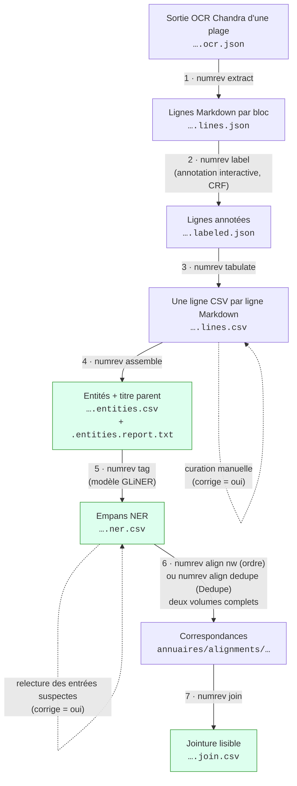
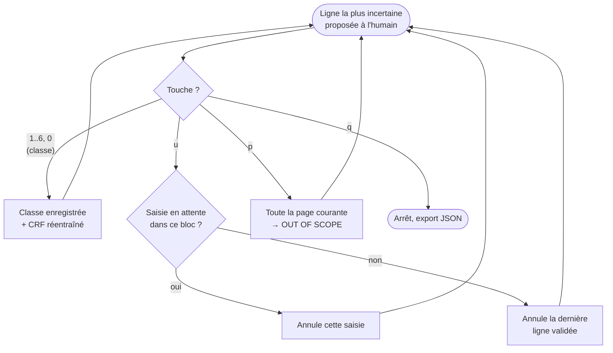
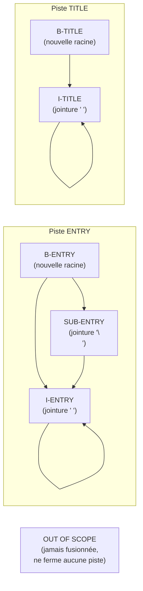
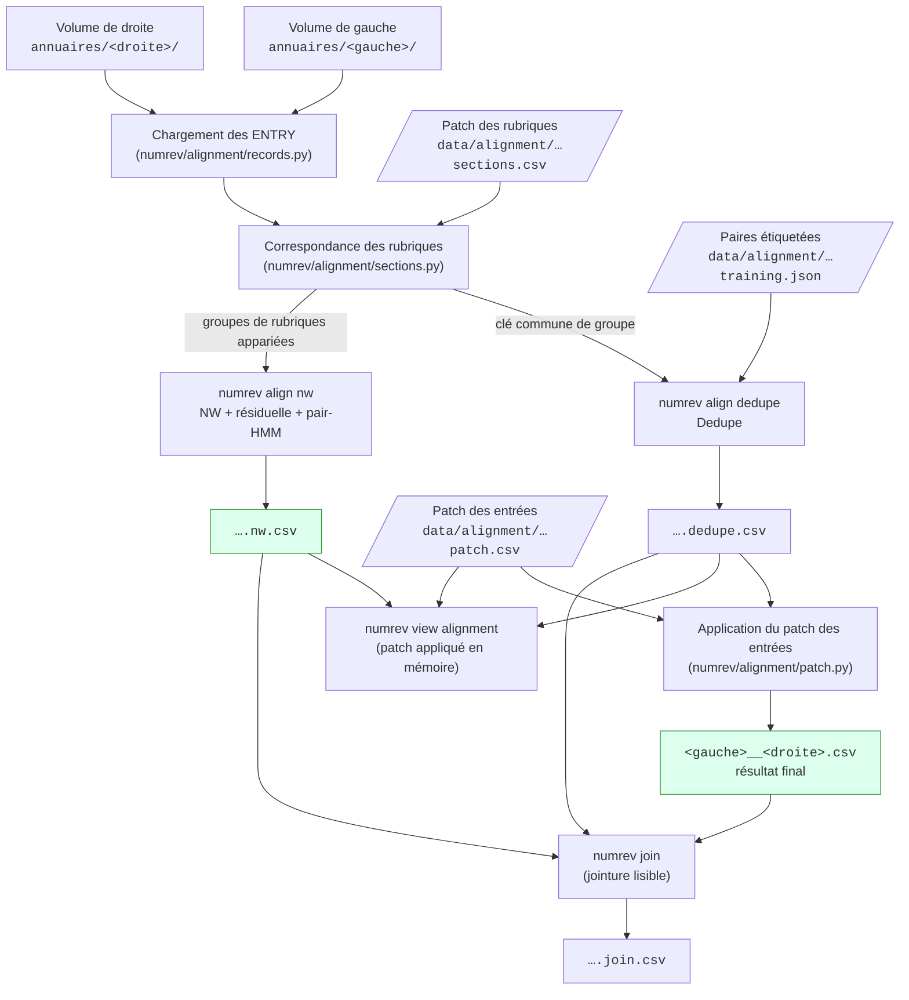

# Documentation de la chaîne de traitement

Ce document décrit en détail chaque étape de la chaîne, ses entrées, ses
sorties et ses points de conception. Le [README](../README.md) en donne la vue
d'ensemble et l'installation.

Documents associés :

- [`guide_annotation_ner.md`](guide_annotation_ner.md) — conventions
  d'annotation des empans `SUBJ` / `DESC` / `ADDR` (étape 5) ;
- [`guide_curation.md`](guide_curation.md) — guide pratique de la curation
  (corriger les lignes, le NER et l'alignement sans perdre ses corrections,
  avec exemples) ;
- [`alignement_ordonne.md`](alignement_ordonne.md) — méthode et
  formalisation de l'alignement ordonné (Needleman-Wunsch + pair-HMM,
  étape 6).

## Sommaire

- [Organisation des fichiers](#organisation-des-fichiers)
- [Corrections humaines rejouables](#corrections-humaines-rejouables--numrevcurationpy)
- [Étape 1 — Extraction des lignes](#étape-1--extraction-des-lignes--numrev-extract)
- [Étape 2 — Annotation interactive des lignes](#étape-2--annotation-interactive-des-lignes--numrev-label)
- [Étape 3 — Table des lignes et curation](#étape-3--table-des-lignes-et-curation--numrev-tabulate)
- [Étape 4 — Entités et arbre des titres](#étape-4--entités-et-arbre-des-titres--numrev-assemble)
- [Étape 5 — Segmentation NER](#étape-5--segmentation-ner-subj--desc--addr)
- [Étapes 6 et 7 — Alignement de deux éditions et jointure](#étapes-6-et-7--alignement-de-deux-éditions-et-jointure)
- [Audit du CRF](#audit-du-crf--numrev-audit-crf)
- [Fichiers produits](#fichiers-produits)
- [Organisation du code](#organisation-du-code)
- [Conventions des commandes](#conventions-des-commandes)

## Organisation des fichiers

Chaque annuaire a son dossier de volume dans `annuaires/` (hors git). La
sortie OCR complète est découpée en **plages de pages** (partie utile de
l'annuaire, liste annexe…), chacune dans son sous-dossier ; toute la chaîne
s'exécute par plage. Une plage est un **document**, nommé
`<volume>.<plage>` ; chaque étape écrit à côté de son entrée un fichier
`<document><suffixe de l'étape>` (convention : `src/numrev/paths.py`) :

```text
annuaires/
├── 1808_AD75-PER292/                         dossier de volume
│   ├── 1808_AD75-PER292.ocr.json             sortie OCR Chandra complète
│   ├── 7-186/                                plage de pages
│   │   ├── 1808_AD75-PER292.7-186.ocr.json   pages de la plage
│   │   ├── ….lines.json                      1 · extract
│   │   ├── ….label-session.json              2 · label (session)
│   │   ├── ….labeled.json                    2 · label
│   │   ├── ….lines.csv                       3 · tabulate (corrigé à la main)
│   │   ├── ….entities.csv                    4 · assemble
│   │   ├── ….entities.report.txt             4 · assemble
│   │   └── ….ner.csv                         5 · tag (corrigé à la main)
│   └── 188-194/
└── alignments/                               sorties des étapes 6 et 7
data/curation/                                corrections humaines (versionnées)
├── 1808_AD75-PER292.7-186.lines.patch.csv    étape 3
└── 1808_AD75-PER292.7-186.ner.patch.csv      étape 5
```

Une plage s'extrait de la sortie OCR complète avec `jq`, par exemple :

```bash
jq 'map(select(.page_index >= 6 and .page_index <= 185))' \
    annuaires/1808_AD75-PER292/1808_AD75-PER292.ocr.json \
    > annuaires/1808_AD75-PER292/7-186/1808_AD75-PER292.7-186.ocr.json
```

**Simulation par défaut.** Toute commande qui écrit des fichiers de données
(étapes du pipeline, alignement, export, tirages de gold, jeu
d'entraînement, entraînement) calcule et vérifie tout — conflits de
curation et lignes orphelines compris — puis affiche les fichiers qu'elle
écrirait (nouveau / remplacé), sans rien écrire. `--apply` écrit
(`numrev/command.py`). `--force` reste distinct : il passe outre un refus
(conflit, orphelin, fichier existant) et n'écrit lui aussi qu'avec
`--apply`. L'annotateur (étape 2) enregistre sa session à chaque action,
mais n'exporte le JSON annoté qu'avec `--apply` ; `numrev train`
sans `--apply` vérifie et convertit les données puis s'arrête avant
d'entraîner. Les audits et les viewers n'écrivent que des rapports ou
rien : ils n'ont pas cette option.

Toutes les étapes passent par la commande `numrev` (`uv run numrev` liste
les commandes, `uv run numrev <commande> --help` détaille les options). Les
étapes 1 à 4 sur une plage :

```bash
D=annuaires/1808_AD75-PER292/7-186/1808_AD75-PER292.7-186
uv run numrev extract  $D.ocr.json --apply       # → $D.lines.json
uv run numrev label    $D.lines.json --apply     # → $D.labeled.json
uv run numrev tabulate $D.labeled.json --apply   # → $D.lines.csv
# curation manuelle dans $D.lines.csv (lignes marquées corrige = oui),
# puis relancer numrev tabulate : les corrections sont capturées et réappliquées
uv run numrev assemble $D.lines.csv --apply      # → $D.entities.csv
```



En pointillés, les interventions manuelles ; en vert, les livrables.

## Corrections humaines rejouables : `numrev/curation.py`

Version vulgarisée, avec exemples : [`guide_curation.md`](guide_curation.md).

Trois étapes demandent une curation humaine : les classes et le texte des
lignes (étape 3), les empans NER et le rattachement des entrées à leur
rubrique (étape 5), les correspondances entre éditions (étape 6). Toutes
suivent le même protocole, pour qu'on puisse relancer toute la chaîne depuis
l'OCR (CRF amélioré, nouveau modèle NER…) sans perdre ce travail.

| Étape | Clé stable | Champs éditables | Patch versionné |
|---|---|---|---|
| 3 · lignes | `cle` (hash du texte OCR) | `classe`, `markdown` (+ lignes ajoutées, `SUPPRIMÉE`) | `data/curation/<document>.lines.patch.csv` |
| 5 · NER | `uuid` d'entité | `tagged_text`, `parent_uuid` | `data/curation/<document>.ner.patch.csv` |
| 6 · alignement | uuid gauche / droit | paire, sans correspondance, `certitude` | `data/alignment/<g>__<d>.patch.csv`, `.sections.csv` |

Pour les étapes 3 et 5, le CSV de sortie est **à la fois la sortie machine
et le fichier qu'on corrige** (Excel, OpenRefine : la curation des lignes a
besoin du contexte de tout le document). Deux colonnes s'y ajoutent :

- `corrige` : à mettre à `oui` sur chaque ligne corrigée, ou **validée telle
  quelle** (confirmer une prédiction est aussi une décision humaine) ; elle
  sert aussi de filtre ;
- `empreinte` : hash des champs éditables tels que la machine les a écrits
  (ne pas y toucher).

À chaque exécution, la commande de l'étape enchaîne trois temps, et **réussit
entièrement ou n'écrit rien** :

1. **capture** : si sa sortie existe déjà, ses lignes `corrige = oui`
   réécrivent le patch versionné (une correction retirée se voit au
   `git diff` ; git sert de copie de sécurité) ;
2. **génération** de la nouvelle sortie machine ;
3. **application** du patch, qui gagne sur la machine.

La commande **panique** (s'arrête, liste les lignes en cause, n'écrit rien)
dès que le résultat ne serait pas prévisible :

- une ligne modifiée (empreinte qui ne correspond plus) **sans**
  `corrige = oui` : oubli, ou altération par le tableur (date, espaces) ;
- une correction qui ne s'applique plus mécaniquement : clé disparue (texte
  OCR changé), texte d'entité modifié en amont depuis la correction NER,
  titre parent disparu ;
- une ligne machine effacée ou déplacée dans le fichier (étape 3).

`--force` résout la panique en prenant la **nouvelle sortie machine** pour
ces lignes (et retire les corrections inapplicables du patch). C'est aussi
le moyen d'annuler une correction : vider `corrige`, relancer avec `--force`.
`--no-capture` ignore le fichier existant et repart du patch versionné
(par exemple après un `git pull` qui l'a modifié). Lancée sans `--apply`,
la commande montre les conflits éventuels et les fichiers qu'elle
réécrirait, sans toucher ni au CSV ni au patch.

Étape 3, opérations sur les lignes :

- **supprimer** : donner la classe `SUPPRIMÉE` (ignorée par l'étape 4) ;
- **ajouter** ou **dupliquer** : insérer une ligne sans clé (ou copier une
  ligne) ; elle reçoit la clé `<clé de base>+n`, et le patch retient la clé
  de la ligne qui la précède (`apres`) pour la réinsérer à sa place ;
- **déplacer** (ordre de lecture de l'OCR à corriger) : `SUPPRIMÉE` sur
  l'originale et une copie sans clé à la bonne place ; l'ordre des lignes
  machine reste celui de l'OCR.

La **clé** `cle` d'une ligne est calculée une fois à l'extraction (étape 1) :
hash du texte OCR normalisé, suffixé `~n` pour la n-ième occurrence d'un
même texte (lignes vides, titres répétés). Elle ne dépend ni de la page ni
du découpage en blocs : ajouter des pages au PDF ou une re-segmentation de
l'OCR ne la change pas, au contraire de l'`uid` (`page.bloc.ligne`), gardé
pour l'ordre de lecture. L'`uuid` d'une entité (étape 4) dérive de la clé de
sa ligne racine : il est donc stable lui aussi.

Les patchs d'alignement (étape 6) ne sont pas capturés depuis un CSV : on
les édite à la main depuis le viewer. Ils suivent sinon les mêmes règles :
le patch gagne, une ligne orpheline (uuid disparu, sans réancrage possible)
fait paniquer `numrev align dedupe`, `numrev align nw` et
`numrev join`, et `--force` l'ignore.

Les patchs vivent dans `data/`, versionné avec le code. Les commits de
données restent séparés de ceux du code (préfixe `données:`), et les commandes
ne commitent jamais elles-mêmes.

## Étape 1 — Extraction des lignes : `numrev extract`

Parse le HTML de chaque bloc de la sortie Chandra et le convertit en lignes
Markdown, avec leur provenance (page, bloc, position).

```bash
uv run numrev extract <document>.ocr.json --apply
```

- **Entrée :** le JSON OCR de Chandra (`<document>.ocr.json` : `markdown` et
  `html` par page, blocs repérés par `data-block-id`).
- **Sortie :** une copie du JSON où chaque page reçoit une liste
  `data_blocks`, chacun portant sa liste de `lines` (`uid`, `line_index`,
  `markdown`, `cle`). Défaut : `<document>.lines.json`.
- **`cle`** : clé stable de la ligne (hash du texte OCR, voir
  [Corrections humaines rejouables](#corrections-humaines-rejouables--numrevcurationpy)),
  recopiée par toutes les étapes suivantes.
- **Tableaux :** chaque cellule (et chaque ligne d'une cellule) devient une
  ligne séparée, sans syntaxe Markdown de tableau.
- Ce schéma (pages → `data_blocks` → `lines`) est le **contrat partagé** des
  étapes 2 et 3 ; il est décrit et validé en un seul endroit,
  `numrev/document.py` (`iter_line_locations`). C'est là qu'il faut le
  modifier.

## Étape 2 — Annotation interactive des lignes : `numrev label`

Un CRF (`python-crfsuite`), réentraîné au fil de l'annotation, propose les
lignes les plus utiles à annoter (graine diversifiée, puis échantillonnage
par incertitude) et prédit les autres.

```bash
uv run numrev label <document>.lines.json --apply
```

- **Entrée :** le JSON de l'étape 1, ou un JSON déjà partiellement annoté
  par cette commande.
- **Sortie :** le même JSON, où chaque ligne reçoit `prediction`,
  `provenance` (`human` / `model` / `unclassified`), `probability` et
  `timestamp`. Défaut : `<document>.labeled.json`, écrit seulement
  avec `--apply` (relancer avec `--apply` et quitter aussitôt par `q`
  exporte une session terminée).
- **Session :** `<document>.label-session.json`, réécrite après chaque action
  (même sans `--apply`) ; l'annotation reprend exactement où elle a été
  arrêtée. `--reset-session` l'ignore.
- **Classes :** `B-ENTRY`, `I-ENTRY`, `SUB-ENTRY`, `B-TITLE`, `I-TITLE`,
  `OUT OF SCOPE`, `¯\_(ツ)_/¯` (incertain).
- **`--seed-size`** : nombre d'annotations diversifiées avant l'échantillonnage
  par incertitude (défaut : 12).

Boucle d'annotation :



Points de conception :

- Les features sont calculées sur le texte normalisé (`normalize_line` :
  marqueurs d'emphase, `#` de tête et espaces finaux retirés ; l'italique
  est gardé comme feature). Elles sont définies dans `numrev/crf/features.py`
  (`PRODUCTION_GROUPS`) ; les modifier change le comportement de
  l'annotateur — pour essayer une feature, voir
  [l'audit du CRF](#audit-du-crf--audit_crf_featurespy).
- La feature `is_page_start` signale une rupture de page sans utiliser le
  numéro de page, qui généraliserait mal d'un document à l'autre.
- La probabilité exportée est l'argmax des **marginales a posteriori**, pas
  un décodage de Viterbi : elle correspond toujours à l'étiquette exportée.
- Le tableau de bord (`rich`) montre le contexte du document à gauche, les
  statistiques (progression, transitions apprises, probabilités des
  candidates) à droite.

## Étape 3 — Table des lignes et curation : `numrev tabulate`

Convertit le JSON, annoté ou non, en CSV : une ligne Markdown par ligne.

```bash
uv run numrev tabulate <document>.labeled.json --apply
```

- **Colonnes :** `cle`, `uid`, `page_index`, `chunk_index`,
  `data_block_index`, `line_index`, `data_block_bbox`, `data_block_label`,
  `markdown`, `classe`, `corrige`, `provenance`, `probability`, `timestamp`,
  `empreinte` (`CSV_FIELDS`). `classe` est la prédiction de l'annotateur
  (`prediction` dans le JSON). `cle` est recopiée du JSON : un JSON sans
  clé (antérieur à l'étape 1 actuelle) est refusé.
- Sur le JSON brut de l'étape 1, `classe` est vide et aucun patch n'est lu
  ni écrit : pratique pour inspecter l'extraction.
- **Curation :** on corrige directement ce CSV (classe, texte, notamment les
  marqueurs de titre `#`) en marquant `corrige = oui`, puis on relance la
  commande, qui capture les corrections dans
  `data/curation/<document>.lines.patch.csv` et les réapplique (voir
  [Corrections humaines rejouables](#corrections-humaines-rejouables--numrevcurationpy)).
  Un nouvel export (CRF amélioré) garde ainsi les corrections et met à jour
  les autres lignes. Ces fichiers servent de référence à l'audit du CRF.

## Étape 4 — Entités et arbre des titres : `numrev assemble`

Recompose les entités logiques (une entrée, un titre) à partir des classes
de lignes, rattache chaque ligne produite à son titre parent et écrit un
rapport.

```bash
uv run numrev assemble <document>.lines.csv --apply
```

- **Entrée :** un CSV de l'étape 3 (colonnes `cle`, `uid`, `markdown`,
  `classe` obligatoires). Les lignes `SUPPRIMÉE` sont ignorées, et les colonnes
  `corrige` / `empreinte` ne sont pas recopiées.
- **Sorties :**
  - `<document>.entities.csv` — une ligne par entité : `ENTRY`, `TITLE` ou
    `OUT OF SCOPE` (toute classe inconnue est recopiée telle quelle), avec
    son `uuid` et le `parent_uuid` de son titre parent ;
  - `<document>.entities.report.txt` — comptages, arbre indenté des titres (entrées
    directes et de tout le sous-arbre) et cas à vérifier.

### Fusion des lignes

Deux « pistes » indépendantes, ENTRY et TITLE, restent ouvertes tant
qu'aucune nouvelle racine `B-ENTRY` / `B-TITLE` n'apparaît : une entrée
peut ainsi continuer par-dessus une ligne `OUT OF SCOPE` ou un titre courant.



- Une continuation sans racine (surtout en début de fichier) devient une
  nouvelle racine de son type et est signalée dans le rapport.
- L'ordre alphabétique des `ENTRY` est vérifié dans l'ordre du document et
  réinitialisé à chaque `TITLE` ; les ruptures sont listées avec l'`uid` de
  l'entrée fautive.
- Une classe inconnue est traitée comme hors champ et signalée à part :
  renommer une classe de ligne impose de mettre `numrev/pipeline/assemble.py` à jour.

### Identifiants et hiérarchie

- **`uuid`** est déterministe : uuid5 du nom du document et de la clé `cle`
  de la **ligne racine** de l'entité, jamais de son texte ni
  de sa page. Il survit aux corrections de texte, à la re-segmentation de
  l'OCR et au rattachement ou détachement de lignes de continuation. La
  colonne `cle` d'une entité garde sa composition en clair (clés de ses
  lignes, séparées par des virgules).
- **`parent_uuid`** : le niveau d'un titre est son nombre de `#` (un titre
  sans `#` prend le niveau le plus profond et est signalé). Le parent d'un
  `TITLE` est le dernier titre précédent de niveau strictement inférieur ;
  celui de toute autre ligne, le dernier titre précédent. Les titres de
  premier niveau et les lignes placées avant tout titre ont pour parent la
  racine `00000000-0000-0000-0000-000000000000`, commune à tous les
  documents.

Pour recompter les entrées depuis le CSV : grouper les `ENTRY` par
`parent_uuid` (entrées directes), puis cumuler en remontant les
`parent_uuid` des titres.

## Étape 5 — Segmentation NER (SUBJ / DESC / ADDR)

Chaque ENTRY est découpée en empans `SUBJ` (qui ?), `DESC` (quoi ?) et
`ADDR` (où ?) par un modèle GLiNER-bi. Les conventions sont fixées dans
[`guide_annotation_ner.md`](guide_annotation_ner.md). Les modèles entraînés
restent hors git (`models/`).

Deux jeux de données versionnés, aux rôles séparés :

| | `data/ner/gold.ls.json` | `data/ner/train.ls.json` |
|---|---|---|
| Rôle | **évaluer** (`numrev audit ner`) | **entraîner** (`numrev train`) |
| Taille | 600 entrées | ~15 000 entrées |
| Origine | tiré une fois (`numrev gold ner`), relu entrée par entrée dans Label Studio | construit par `numrev train-set` à partir des CSV NER de `annuaires/` |
| Qualité | vérité terrain | sortie du modèle, corrigée là où une ligne porte `corrige = oui` |

Les textes du gold sont toujours exclus de l'entraînement (comparaison sur le
texte normalisé, pas sur l'`uid`).

### Inférence : `numrev tag`

```bash
uv run numrev tag <document>.entities.csv --model models/<nom>.gliner-model --apply
```

- Ajoute après `entity` la colonne `tagged_text` (texte d'origine balisé,
  ex. `<SUBJ>Dupont</SUBJ>, <ADDR>rue A, 1.</ADDR>`) et les comptes
  `subject_count`, `description_count`, `address_count`.
- Les libellés sont lus dans `<modèle>/ner_config.json`, écrit à
  l'entraînement. Le modèle reçoit le texte normalisé ; les empans sont
  reportés sur le Markdown d'origine.
- Deux colonnes guident la relecture : `ner_confidence` (score minimal des
  empans) et `ner_suspect`, la liste des motifs de relecture prioritaire
  (`numrev/ner/suspicion.py`) :
  - `aucun empan` ;
  - `score bas` (sous `--min-score`, défaut 0,9) ;
  - `texte non couvert` (un mot hors de tout empan) ;
  - `SUBJ absent en tête` ;
  - `signature inhabituelle` (ex. deux SUBJ : deux entrées fusionnées).

  Ces motifs sont structurels et ne dépendent d'aucun lexique propre aux
  volumes.
- **Relecture :** on corrige directement ce CSV (`tagged_text`, et
  `parent_uuid` pour rattacher une entrée à une autre rubrique) en marquant
  `corrige = oui` ; à la prochaine inférence, les corrections sont capturées
  dans `data/curation/<document>.ner.patch.csv` (avant le chargement du
  modèle) et réappliquées par `uuid` (voir
  [Corrections humaines rejouables](#corrections-humaines-rejouables--numrevcurationpy)).
  Ce CSV est l'entrée de l'étape 6 et de la construction du jeu
  d'entraînement.

### Explorer un volume : `numrev view directory`

```bash
uv run numrev view directory
```

Visualiseur d'un CSV NER (`*.ner.csv`, choisi dans `annuaires/` ou
téléversé) :

- **Contexte :** empans colorés par classe ; chaque entrée est replacée dans
  sa rubrique (chemin des titres), avec un bandeau à chaque changement de
  rubrique.
- **Filtres :** type de ligne, rubrique (sous-rubriques comprises), pages,
  recherche (texte ou expression régulière), signature, motifs de relecture,
  confiance maximale.
- **Statistiques :** signatures, motifs, et rubriques classées par nombre
  d'entrées suspectes, pour organiser la relecture.

### Entraînement

```bash
# En local (a besoin de annuaires/) : régénère data/ner/train.ls.json à partir
# des CSV NER (curés en priorité), tiré par forme typographique, gold exclu.
uv run numrev train-set --apply
git add data/ner && git commit && git push

# Sur la machine GPU (après git pull && uv sync) :
uv run numrev train data/ner/train.ls.json -o models/<nom>.gliner-model --apply
```

- Le jeu d'entraînement vaut ce que valent les CSV : ils doivent suivre le
  guide d'annotation, car le modèle réapprend les écarts de convention de
  ses données.
- `numrev train` accepte un ou plusieurs fichiers Label Studio, convertit
  les empans en caractères en empans de tokens, calcule `max_width`, exclut
  à nouveau les textes du gold, valide sur un découpage **par page** et
  écrit `<modèle>/ner_config.json`.
- Modèle de base : `knowledgator/gliner-bi-base-v2.0` (bi-encodeur). Un
  GLiNER-relex (`--base-model knowledgator/gliner-relex-large-v0.5`) s'entraîne
  et s'utilise aussi, mais n'a rien gagné à conditions égales :
  [Expérience GLiNER-relex](experience_gliner_relex.md).

### Audit : `numrev audit ner`

```bash
uv run numrev gold ner --apply      # une seule fois : tirage du gold
uv run numrev audit ner --split dev --model models/<actuel>.gliner-model --model models/<nom>.gliner-model
uv run numrev audit ner --split dev --predictions autre=sortie.ner.csv
```

- **Gold :** entrées stratifiées (courant / forme rare / signature rare /
  désaccord) et pondérées pour rester représentatives du corpus ;
  configuration Label Studio dans `data/ner/label_studio_config.xml`.
  Découpage figé `dev` (choix, réglages) / `test` (confirmation du modèle
  retenu, une seule fois). Le gold n'est jamais retiré (`numrev gold ner` refuse
  d'écraser le fichier, sauf `--force`), pour que les scores
  restent comparables.
- **Métrique principale :** exactitude par entrée (part des entrées sans
  correction à faire), avec intervalle de confiance par bootstrap des pages
  et écarts appariés contre le premier système. Aussi : F1 par classe,
  exactitude par token, types d'erreurs, ventilation par volume / strate /
  profil, couverture et rappel des motifs `ner_suspect`.
- **Sortie :** `reports/ner/rapport.md` et `erreurs.csv`.
- Une entrée de la strate « courant » pèse environ 1,5 point sur le split
  `dev` : comparer aussi les nombres bruts d'erreurs.
- Les CSV NER ne sont que partiellement relus (`corrige = oui`) : ce ne sont
  pas des vérités terrain.

## Étapes 6 et 7 — Alignement de deux éditions et jointure

Retrouve, entre deux éditions d'un annuaire, les ENTRY qui décrivent la même
personne ou le même commerce. Deux méthodes produisent des correspondances
**un-à-un** au même format :

| | `numrev align dedupe` | `numrev align nw` |
|---|---|---|
| Principe | [Dedupe](https://github.com/dedupeio/dedupe) `RecordLink` : ressemblance apprise sur des paires étiquetées | ordre des entrées : Needleman-Wunsch par rubrique, puis pair-HMM entre ancres |
| Étiquetage | oui, en console | aucun |
| Corrections manuelles des entrées | appliquées (patch) | non appliquées (seulement dans le viewer) |
| Sortie | `<gauche>__<droite>.dedupe.csv` (brut) et `<gauche>__<droite>.csv` (final) | `<gauche>__<droite>.nw.csv` |
| Durée (1807/1808) | quelques minutes | ~12 s |

Les deux méthodes restent à comparer sur un corpus d'alignements vérifiés.



Les fichiers de `data/alignment/` sont **versionnés** (au contraire de
`annuaires/`) : ils portent tout le travail humain et survivent aux
relances.

### Chargement des volumes

`numrev/alignment/records.py` lit un dossier de volume en entier : ses
sous-dossiers de plages triés par première page, chacun par son propre
`<volume>.<plage>.ner.csv` (un fichier manquant est une erreur). Seules les
ENTRY sont alignées. Pour chacune :

- **rubrique** : titre ancêtre de niveau 2, à défaut de niveau 1, selon
  `parent_uuid` (donc sans héritage d'une plage à l'autre) ; la clé est sans
  accents ni ponctuation, en minuscules ;
- **SUBJ** : texte des empans SUBJ, sans Markdown ;
- **texte** : texte complet sans Markdown. DESC et ADDR, plus variables
  d'une édition à l'autre, n'interviennent que par lui.

### Correspondance des rubriques

Partagée par les deux méthodes et le viewer (`numrev/alignment/sections.py`).
Une rubrique est une suite contiguë d'ENTRY de même rubrique, identifiée par
l'uuid de son TITLE. L'ordre des rubriques étant stable d'une édition à
l'autre, elles sont alignées par Needleman-Wunsch sur la similarité
Jaro-Winkler de leur clé (seuil 0,8, `numrev/alignment/sequence.py`) : « Liste » et
« Listes de non-commerçans » se correspondent.

Ce qui échappe à l'ordre ou au seuil se corrige à la main dans
`data/alignment/<gauche>__<droite>.sections.csv` (colonnes `left_uuid,
right_uuid, left_title, right_title, note`) :

- une ligne à deux uuid lie deux rubriques ; un même uuid peut figurer dans
  plusieurs lignes, et les composantes connexes forment des **groupes** 1-1,
  1-N ou N-M (« Jardiniers-fleuristes, pépiniéristes, marchands d'arbres »
  ↔ « Marchands d'arbres ») ;
- une ligne à un seul uuid déclare une rubrique sans correspondance.

Le patch gagne : ses rubriques sont retirées de l'alignement automatique.
Si un uuid disparaît (re-segmentation amont), la ligne est réancrée sur la
rubrique de même titre nettoyé, unique dans l'annuaire, et le patch est
réécrit par les commandes d'alignement ; faute de candidat unique, la ligne
est **orpheline** : conservée, non appliquée, et les commandes paniquent
(`--force` pour l'ignorer).

### Méthode Dedupe : `numrev align dedupe`

```bash
uv run numrev align dedupe annuaires/1807_AD75-PER292 annuaires/1808_AD75-PER292 --apply
uv run numrev align dedupe <gauche> <droite> --label --apply          # compléter l'étiquetage
uv run numrev align dedupe <gauche> <droite> --patch-only --apply    # réappliquer le patch, sans Dedupe
uv run numrev align dedupe <gauche> <droite> --raw-sections --apply   # variante à clés de rubrique brutes
```

- **Champs comparés :** rubrique, SUBJ et texte, en minuscules. La rubrique
  est comparée par la **clé commune de son groupe** (clé de sa première
  rubrique de gauche) : deux rubriques appariées ont la même clé. Cette
  substitution est aussi appliquée, à la lecture, aux paires du fichier
  d'entraînement, qui reste donc valable. `--raw-sections` garde les clés
  propres à chaque volume et écrit
  `<gauche>__<droite>.raw-sections[.dedupe].csv`, pour comparer les deux
  variantes.
- **Étiquetage :** à la première exécution (ou avec `--label`), Dedupe
  propose des paires en console (`y` / `n` / `u` incertain / `f` terminer).
  Elles sont enregistrées dans
  `data/alignment/<gauche>__<droite>.training.json` et réutilisées ensuite
  sans interaction.
- **Seuil :** `--threshold` (score minimal, défaut 0,5).
- **Seulement entre rubriques appariées :** Dedupe ne voit la rubrique que
  comme un champ parmi d'autres et peut lier deux rubriques qui ne se
  correspondent pas ; ces liens sont écartés (`restrict_to_corresponding`,
  `numrev/alignment/sections.py`), comme les paires du patch des entrées qui
  violent cette règle (signalées en console : lier d'abord les rubriques).
  Le viewer et l'export appliquent le même filtre aux sorties plus
  anciennes.
- **Sorties** dans `annuaires/alignments/`, dans l'ordre de l'annuaire de
  gauche : `<gauche>__<droite>.dedupe.csv` (liens bruts) et
  `<gauche>__<droite>.csv` (résultat final, Dedupe + patch des entrées). La
  console résume les taux d'appariement, la distribution des scores et
  l'effet du patch.
- `prepare_training` prend quelques minutes sur ~17 000 × 16 000 entrées.
  Dedupe 3.0.3 exige `btrees<6` (fixé dans `pyproject.toml`).

### Méthode ordonnée : `numrev align nw`

```bash
uv run numrev align nw annuaires/1807_AD75-PER292 annuaires/1808_AD75-PER292 --apply
uv run numrev align nw <gauche> <droite> --no-context --apply   # Needleman-Wunsch seul
```

Sans apprentissage supervisé ; méthode, formalisation et premiers résultats
dans [`alignement_ordonne.md`](alignement_ordonne.md). En bref :

1. rubriques alignées comme ci-dessus ; les entrées sont traitées par
   groupe de rubriques appariées, et seulement là : une rubrique sans
   correspondance n'est jamais appariée (la lier dans le patch des
   rubriques) ;
2. Needleman-Wunsch sur les entrées de chaque segment ; ses paires de
   similarité ≥ 0,9 sont des **ancres** ;
3. passe résiduelle (affectation optimale, similarité ≥ 0,85) sur les
   entrées hors des paires NW, pour les inversions locales. Sur le gold des
   inversions 1807/1808, cette règle est précise (≈ 93 %) et ce qu'elle
   manque ne se départage pas automatiquement : les cas douteux vont à la
   relecture (ci-dessous), pas à une règle plus fine ;
4. entre deux ancres consécutives, un **pair-HMM** (`numrev/alignment/pair_hmm.py`) garde
   les paires de probabilité a posteriori > 0,5 : une paire de similarité
   moyenne encadrée par des paires sûres peut être retenue. Les émissions
   sont estimées sans étiquettes ; seules les transitions sont apprises par
   EM.

La similarité vaut `w · JaroWinkler(SUBJ) + (1 − w) · Indel(texte)` (texte
seul sans SUBJ, `--subj-weight`, défaut 0,5). Les seuils se règlent par
`--threshold`, `--anchor-threshold`, `--residual-threshold` et
`--section-threshold`.

Sortie : `annuaires/alignments/<gauche>__<droite>.nw.csv`, avec `source` =
`nw` (ancre), `nw-contexte` (paire du pair-HMM, score = probabilité a
posteriori) ou `nw-residuel`. Le patch des entrées n'est pas appliqué. La
console affiche les transitions estimées et l'accord avec le `.dedupe.csv`
s'il existe.

### Format des correspondances

Une ligne par correspondance ; une entrée absente du fichier n'a pas de
correspondance.

| Colonne | Contenu |
|---|---|
| `left_file`, `left_uuid`, `right_uuid`, `right_file` | identification des deux entrées |
| `score` | score de la méthode (vide pour une paire saisie à la main) |
| `source` | `dedupe`, `manuel`, `manuel-incertain` (patch, `certitude=incertaine`), `nw`, `nw-contexte` ou `nw-residuel` |
| `left_section`, `right_section` | titres des rubriques, pour la relecture |
| `left_tagged_text`, `right_tagged_text` | textes balisés, pour la relecture |

### Corrections manuelles des entrées

Les méthodes peuvent être relancées à chaque amélioration des étapes amont ;
les décisions humaines vivent donc à part, dans
`data/alignment/<gauche>__<droite>.patch.csv` (`numrev/alignment/patch.py`),
réappliqué après chaque exécution de Dedupe.

- **Une ligne = une décision :** `left_uuid` + `right_uuid` → ces deux
  entrées se correspondent ; un seul uuid → cette entrée n'a pas de
  correspondance. Colonnes : `left_file, left_uuid, right_uuid, right_file,
  left_section, right_section, left_tagged_text, right_tagged_text, note,
  certitude`.
- **Décision incertaine :** `certitude = incertaine` quand la relecture n'a
  pas permis de trancher (homonymes, graphies trop éloignées). La paire est
  appliquée avec la source `manuel-incertain`, visible dans l'export
  (`certitude = incertaine`) ; l'utilisateur des données choisit de s'en
  servir ou non. Colonne facultative : un patch sans elle reste valide ;
  toute autre valeur est une erreur.
- **Le patch gagne :** tout lien automatique qui touche un uuid du patch est
  écarté, puis les paires du patch sont ajoutées (`source = manuel`).
  Valider une paire correcte la protège des relances (son score est gardé).
- **Réancrage :** si une entrée est re-segmentée en amont, son uuid change ;
  on cherche alors l'entrée unique de même texte normalisé dans la même
  rubrique (d'où l'instantané texte + rubrique) et le patch est réécrit.
  Sans candidat unique, la ligne est **orpheline** : signalée, conservée,
  non appliquée.
- Un uuid présent dans deux lignes, ou une ligne sans uuid, est une erreur.

### Explorer et corriger : `numrev view alignment`

```bash
uv run numrev view alignment
```

Le viewer est en lecture seule. On choisit une sortie brute (`*.dedupe.csv`,
`*.nw.csv` ou une variante `rubriques-brutes`) ; la paire de volumes se
déduit du nom de fichier, les deux annuaires sont relus en entier et le
patch des entrées est appliqué en mémoire : l'écran montre le résultat
final.

- **Une table dans l'ordre naturel :** correspondances et entrées de gauche
  sans correspondance dans l'ordre de l'annuaire de gauche ; une entrée de
  droite sans correspondance vient après la paire qui contient l'entrée de
  droite appariée qui la précède. Un bandeau marque chaque changement de
  rubrique.
- **Statut de chaque ligne, en clair** (dernière colonne) : `✓ appariée`
  (bordure verte ; `relue` ou `relue, incertaine` pour un lien du patch),
  `? non appariée · candidate à décider` (fond ambre : deux entrées **non**
  appariées, soumises au relecteur), `✗ sans correspondance` (bordure
  grise). Viennent ensuite le score, et pour une ligne à vérifier un badge
  d'incertitude (moyenne en orange, forte en rouge) avec son motif. Le
  bouton **Légende**, à côté de la pagination, rappelle ces conventions.
- **Barre latérale, du plus courant au plus fin :** alignement ; *Filtres*
  (statut des lignes, incertitude, rubrique, recherche, plage de scores,
  corrections manuelles) ; *Affichage* (tri, dont *incertitude
  décroissante*, lignes par page, score signalé en rouge) ; *Export* ; et,
  repliés en bas, les *Réglages fins de la relecture* (similarité minimale
  d'une candidate, écart « homonyme proche »).
- **Seulement entre rubriques appariées :** un lien entre rubriques non
  appariées est écarté ; l'indicateur *Liens écartés* les compte, et un
  encart liste les paires du patch concernées.
- **Encarts :** lignes orphelines des deux patchs ; **Rubriques** : une
  table par groupe de rubriques appariées (auto ou patch), puis par
  rubrique seule, avec les entrées et la part appariée de chaque côté et
  les uuid pour le patch des rubriques.
- **Copie pour les patchs :** le bouton `uuid` d'une entrée ou d'un bandeau
  de rubrique copie son uuid ; le bouton `copier` d'une ligne copie une
  ligne de patch prête à coller (la paire, ou l'entrée seule) ; le bouton
  `incertaine` d'une paire ou d'une candidate copie la même ligne avec
  `certitude=incertaine` ; `en-tête du patch` copie l'en-tête pour créer le
  fichier.
- **Export CSV :** le bouton *Exporter en CSV* de la barre latérale
  télécharge les lignes affichées (filtres et tri appliqués) au format de
  `numrev join` (ci-dessous) ; la case *Pour un tableur en
  français* (cochée par défaut) choisit le séparateur `;` et l'UTF-8 avec
  BOM.

Les patchs s'éditent à la main (tableur ou éditeur de texte) : coller une
ligne copiée valide une paire ou confirme une absence de correspondance ;
pour apparier deux entrées, coller la ligne de l'une et y reporter l'`uuid`
(et le fichier) de l'autre. `numrev align dedupe --patch-only --apply` régénère
ensuite le CSV final en quelques secondes.

Pour tester le viewer, utiliser un wrapper qui redéfinit `ALIGNMENTS_DIR`
et `PATCH_DIR`, jamais les dossiers réels.

### Étape 7 — Jointure lisible : `numrev join`

```bash
uv run numrev join annuaires/alignments/<g>__<d>.nw.csv [--excel] [-o sortie.csv] --apply
```

Produit, pour les utilisateurs des données (historiens), la jointure des
deux volumes alignés (leurs `*.ner.csv`) : **une ligne par correspondance ou par
entrée sans correspondance**, dans l'ordre naturel du viewer
(`numrev/alignment/export.py`, partagé avec lui). L'entrée est une sortie
d'alignement (`*.dedupe.csv`, `*.nw.csv` ou le CSV final) ; comme dans le
viewer, les volumes sont relus en entier et le patch des entrées est
appliqué en mémoire, sans être réécrit (`--no-patch` l'ignore). Sortie
par défaut : `<entrée sans .csv>.join.csv` à côté de l'entrée.

| Colonne | Contenu |
|---|---|
| `statut` | `apparié`, `gauche seulement`, `droite seulement` ou `candidate` (candidate non appariée, seulement avec `--candidates` ou depuis le viewer) |
| `score`, `methode` | Score et source du lien (`dedupe`, `nw`, `nw-contexte`, `nw-residuel`, `manuel`, `manuel-incertain`, `candidate`) ; vides sans correspondance |
| `certitude` | Pour une paire : `relue` (patch), `incertaine` (patch, `certitude=incertaine`) ou `automatique` |
| `niveau_incertitude` | Pour une paire automatique ou une candidate : `faible`, `moyenne` ou `forte` (vide pour une paire relue) |
| `motifs_relecture` | Motifs de cette incertitude (`déduite des voisines (p < 0,9)`, `homonyme proche`, `candidate non appariée`), séparés par « \| » |
| `gauche_…`, `droite_…` | Pour chaque côté : `volume`, `page`, `rubrique` (titre lisible), `texte` (sans Markdown), `sujet` / `description` / `adresse` (texte des empans SUBJ / DESC / ADDR, plusieurs empans d'une classe séparés par « \| »), `texte_balise` (`tagged_text` d'origine), `uuid` |

`--excel` écrit avec le séparateur `;` et en UTF-8 avec BOM, qu'un tableur
réglé en français ouvre directement ; sans l'option, CSV standard (`,`,
UTF-8). `--candidates` ajoute les candidates non appariées ; `--margin`
règle l'écart « homonyme proche ».

### Relecture ciblée : motifs et incertitude

L'alignement automatique n'est pas modifié : `numrev/alignment/review.py`
signale seulement, après coup, les décisions qu'une relecture humaine peut
corriger, avec un motif explicite (même principe que `ner_suspect` pour la
NER). Calcul par segment, avec la similarité de la méthode ordonnée :

| Motif | Concerne | Règle |
|---|---|---|
| `déduite des voisines (p < 0,9)` | paire `nw-contexte` | retenue par le pair-HMM parce que ses voisines sont appariées, mais de probabilité a posteriori < 0,9 |
| `homonyme proche` | paire `nw`, `nw-residuel` ou `dedupe` | une autre entrée du segment, d'un côté ou de l'autre, est à moins de 0,05 de similarité (`--margin`) |
| `candidate non appariée` | deux entrées sans correspondance | chacune est la plus proche de l'autre dans le segment, similarité dans [τ ; θr[ (seuils de Needleman-Wunsch et de la passe résiduelle) ; jamais une entrée déclarée seule au patch |

L'**incertitude** est ordinale (pour trier, ce n'est pas une probabilité) :
`faible` sans motif ; `moyenne` avec un motif ; `forte` pour une candidate
non appariée, plusieurs motifs ou une paire déduite des voisines de
probabilité < 0,7. Aucun paramètre n'est appris sur un volume. Sur
1807/1808 : 445 lignes à vérifier (258 d'incertitude moyenne, 187 forte)
pour 14 491 paires. Les décisions vont au patch des entrées ; les
conventions de relecture sont dans
[`guide_relecture_alignement.md`](guide_relecture_alignement.md).

### Gold des inversions et audit de la relecture

```bash
uv run numrev gold alignment annuaires/<g> annuaires/<d> [--per-stratum 4] --apply   # une fois par paire
uv run numrev audit alignment data/alignment/<g>__<d>.gold-inversions.csv
```

- `numrev gold alignment` tire des paires candidates
  « inversion » (entrées laissées seules par Needleman-Wunsch, qui croisent
  au moins une paire ordonnée ; meilleure partenaire croisée de chaque
  entrée de gauche), stratifiées par déplacement × similarité, avec leur
  poids. On les étiquette à la main dans `meme_entree` : `OUI`, `NON` ou
  `INCERTAIN`, selon le guide de relecture. Un fichier existant n'est
  jamais écrasé sans `--force`.
- `numrev audit alignment` en tire `reports/alignment/<g>__<d>.md` :
  précision et gain plafond de la règle de la passe résiduelle, devenir de
  chaque paire du gold selon la relecture (retenue avec ou sans motif,
  candidate non appariée, ni l'une ni l'autre), part de OUI par
  incertitude, charge de relecture, et rubriques sans correspondance (avec
  leurs entrées, exclues de tout appariement). Le gold ne contenant que des
  inversions de rubriques appariées, le motif `déduite des voisines` et la
  perte due aux rubriques sans correspondance n'y sont pas évalués.
- **Pour une nouvelle paire d'annuaires**, commencer par les rubriques sans
  correspondance (console d'`numrev align nw`, encart
  *Rubriques* du viewer, section 3 du rapport d'audit) :
  leurs entrées ne sont jamais appariées et le gold ne voit pas cette perte.
  Lier dans le patch des rubriques celles qui ont un équivalent. Ensuite,
  les seuils ne sont pas à reprendre de 1807/1808 les yeux fermés : tirer un petit gold
  (`--per-stratum 4`, ≈ 100 paires), l'étiqueter, lancer l'audit, et
  n'ajuster τ, θr ou `--margin` que si le rapport l'exige (part de OUI qui ne
  baisse plus de l'incertitude faible à forte, règle imprécise, motifs qui n'attrapent pas
  les erreurs).

## Audit du CRF : `numrev audit crf`

Mesure la performance du CRF de l'étape 2 et l'apport de chacune de ses
features, contre les CSV corrigés à la main `*.lines.csv`
(colonne `classe`, lignes `SUPPRIMÉE` exclues).

```bash
uv run numrev audit crf                 # tous les *.lines.csv sous annuaires/
uv run numrev audit crf a.lines.csv b.lines.csv -o reports/mon_audit
```

- **Entrées :** les CSV curés et, à côté de chacun, le
  `<document>.lines.json` qu'a vu l'annotateur. Les features sont calculées
  sur ce JSON, et les classes curées y sont rattachées par la clé de ligne
  `cle` (`numrev/crf/silver.py` ; une ligne ajoutée à la main, sans
  observation, est ignorée) : le texte ayant parfois été corrigé à la curation
  (marqueurs `#`), calculer les features sur le CSV curé ferait fuiter les
  étiquettes.
- **Référence « silver » :** les classes curées ne diffèrent des prédictions
  d'origine (relues dans `<document>.labeled.json`) que sur ~0,2 %
  des lignes ; les scores absolus sont donc optimistes.
- **Sortie :** `reports/crf/` par défaut — `rapport.md` (résumé,
  recommandations, analyses), tables CSV et `resume.json`.
- **Contenu :** performances par classe et par entité (règles de l'étape 4)
  selon deux validations croisées (intra-document par blocs de pages
  contiguës ; un volume laissé de côté), avec bootstrap par page ;
  calibration ; information mutuelle et redondance des features ; ablations
  jugées contre un plancher de bruit mesuré par des features placebo ;
  groupes candidats ; courbe d'apprentissage ; analyse d'erreurs.
- **Options :** `--workers`, `--bootstrap`, `--folds`,
  `--no-learning-curve` / `--no-candidates` / `--no-single-groups` (plus
  rapide), `--hyperparams` (grille c1 × c2).

Pour tester une feature, ajouter un groupe à `CANDIDATE_GROUPS` dans
`numrev/crf/features.py` : l'audit l'évalue sans changer l'annotateur.
`LEGACY_GROUPS` reproduit un jeu de features antérieur, évalué comme
`production_v1` pour comparaison.

## Fichiers produits

| Fichier | Produit par | Contenu |
|---|---|---|
| `….lines.json` | `numrev extract` | Pages → blocs → lignes Markdown (`uid`, `line_index`, `markdown`, `cle`) |
| `….labeled.json` / `.label-session.json` | `numrev label` | Classe, provenance, probabilité de chaque ligne ; session reprenable |
| `….lines.csv` | `numrev tabulate` + curation manuelle | Une ligne CSV par ligne Markdown, corrigée à la main (`corrige = oui`) |
| `….entities.csv` | `numrev assemble` | Une ligne par entité (`ENTRY`, `TITLE`, `OUT OF SCOPE`) avec `uuid`, `parent_uuid`, texte fusionné et provenance |
| `….entities.report.txt` | `numrev assemble` | Comptages, arbre des titres, cas à vérifier |
| `….ner.csv` | `numrev tag` + relecture manuelle | Le CSV d'entités avec `tagged_text`, comptes d'empans, `ner_confidence`, `ner_suspect`, corrigé à la main (`corrige = oui`) |
| `data/curation/<document>.lines.patch.csv`, `.ner.patch.csv` | capture automatique (étapes 3 et 5) | Corrections humaines des lignes et du NER (versionnées) |
| `annuaires/alignments/<g>__<d>.dedupe.csv` | `numrev align dedupe` | Correspondances brutes de Dedupe |
| `annuaires/alignments/<g>__<d>.csv` | `numrev align dedupe` | Correspondances finales (Dedupe + patch) |
| `annuaires/alignments/<g>__<d>.nw.csv` | `numrev align nw` | Correspondances de la méthode ordonnée |
| `annuaires/alignments/<g>__<d>.….join.csv` | `numrev join`, viewer | Jointure lisible des deux volumes alignés (pour les utilisateurs des données) |
| `data/alignment/<g>__<d>.training.json` | `numrev align dedupe --label` | Paires étiquetées pour Dedupe (versionné) |
| `data/alignment/<g>__<d>.sections.csv` | édition manuelle | Patch des rubriques (versionné) |
| `data/alignment/<g>__<d>.patch.csv` | édition manuelle | Patch des entrées (versionné) |
| `data/alignment/<g>__<d>.gold-inversions.csv` | `numrev gold alignment` + étiquetage manuel | Gold des inversions (versionné) |
| `data/ner/gold.ls.json`, `data/ner/train.ls.json` | `numrev gold ner` + Label Studio, `numrev train-set` | Gold d'évaluation et jeu d'entraînement NER (versionnés) |
| `reports/crf/`, `reports/ner/`, `reports/alignment/` | audits | Rapports Markdown et tables |

## Organisation du code

Le code est un paquet Python, `src/numrev/`, installé par `uv sync` avec la
commande `numrev` ; les commandes se lancent depuis la racine du dépôt (les
chemins `annuaires/`, `data/`, `reports/`, `models/` sont relatifs).

| Module | Rôle |
|---|---|
| `cli.py` | Point d'entrée : table des commandes (nom, module, résumé) ; un module n'est importé que pour la commande lancée |
| `command.py` | Conventions communes : `Writes` et `--apply`, `CommandError`, options partagées, sortie par défaut |
| `paths.py` | Noms et emplacements des fichiers : suffixes des étapes, nom de document, découverte des plages, fichiers d'une paire (`Pair`) |
| `pipeline/` | Une commande par étape : `extract`, `label`, `tabulate`, `assemble`, `tag`, `align_nw`, `align_dedupe`, `join` |
| `viewers/` | Viewers Streamlit `directory` et `alignment` (`numrev view`) |
| `devtools/` | Gold (`ner_gold`, `alignment_gold`), jeu d'entraînement et entraînement NER (`ner_dataset`, `ner_train`), audits (`crf_audit`, `ner_audit`, `alignment_audit`) |
| `document.py` | Schéma pages → `data_blocks` → `lines`, validation et parcours (`iter_line_locations`) |
| `curation.py` | Protocole des corrections humaines rejouables : clés de ligne, empreintes, capture, application, panique (`CurationConflict`), écriture atomique des CSV |
| `titles.py` | Niveau et texte lisible des titres, racine de l'arbre des titres (`ROOT_UUID`) |
| `crf/` | Cœur du CRF : `labels.py`, `features.py` (groupes de features), `model.py` (entraînement, marginales), `active_learning.py` (moteur de l'annotateur), `silver.py` et `evaluation.py` (audit) |
| `ner/` | `spans.py` (empans, `tagged_text`, Label Studio, normalisation Markdown), `html.py` (rendu des empans pour les viewers), `shapes.py` (formes typographiques), `corpus.py` (lecture des CSV NER), `metrics.py`, `suspicion.py` (motifs de relecture), `gliner.py` (chargement et prédiction) |
| `alignment/records.py` | Chargement des volumes, champs comparés, similarité, lecture et écriture des correspondances |
| `alignment/pair.py` | Chargement d'une paire (volumes + correspondance des rubriques), bilans en console |
| `alignment/sections.py` | Correspondance des rubriques et son patch, segments à aligner |
| `alignment/nw.py` | Méthode ordonnée : Needleman-Wunsch, passe résiduelle, pair-HMM entre les ancres |
| `alignment/sequence.py`, `alignment/pair_hmm.py` | Needleman-Wunsch ; pair-HMM |
| `alignment/patch.py` | Patch des entrées |
| `alignment/review.py` | Motifs de relecture, incertitude et candidates non appariées |
| `alignment/export.py` | Jointure dans l'ordre naturel (viewer, `numrev join`) et export CSV lisible |
| `stats.py`, `reporting.py` | Bootstrap, intervalles, calibration ; mise en forme Markdown des rapports d'audit |

## Conventions des commandes

- Une commande par étape ou par outil, déclarée dans `cli.py` ; son module
  expose `add_arguments(parser)` et `run(args)`. Noms de commandes et
  d'options en anglais, aide et messages en français ; `-o/--output` a
  toujours une valeur par défaut dérivée du nom d'entrée (`paths.py`).
- Mêmes noms pour les mêmes choses dans toutes les commandes : l'entrée des
  étapes 1 à 5 est l'argument positionnel `input` ; toute sortie (fichier
  ou dossier de rapport) est `-o/--output` ; `--model` désigne toujours un
  modèle entraîné (`train` prend `--base-model`) ; `--force` est le seul
  moyen d'écraser un gold ; `--gold`, `--root`, `--seed`, `--bootstrap`,
  `--threshold`, `--min-score`, `--batch-size` et `--margin` ont le même
  sens partout où ils apparaissent.
- Sortie console via `rich` (`✅` pour un succès). Une erreur attendue lève
  `CommandError` (fichier introuvable, entrée invalide) : `cli.py` affiche
  `Erreur : …` et sort avec le code 1, comme pour une panique de curation.
- Existence des fichiers d'entrée vérifiée avant tout traitement ; erreurs
  typées plutôt que des `except Exception` génériques, sauf pour
  l'inférence GLiNER par lots (`ner/gliner.py`), qui doit résister aux
  erreurs imprévisibles de torch.
- Tests : `unittest` (pas pytest), lancés depuis la racine ;
  `ruff check src tests` (imports triés, pas d'import inutile).
