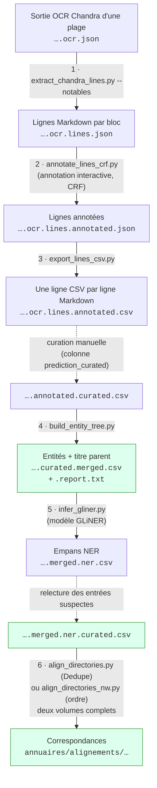
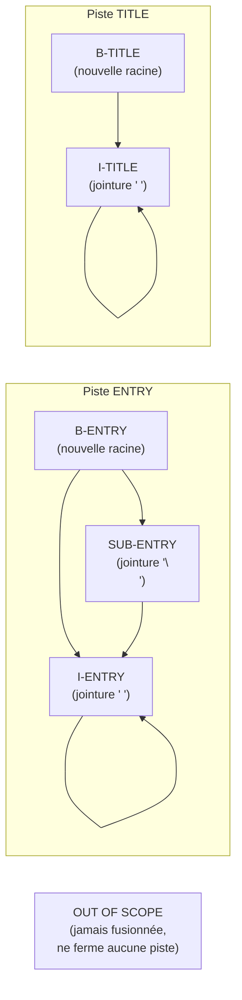
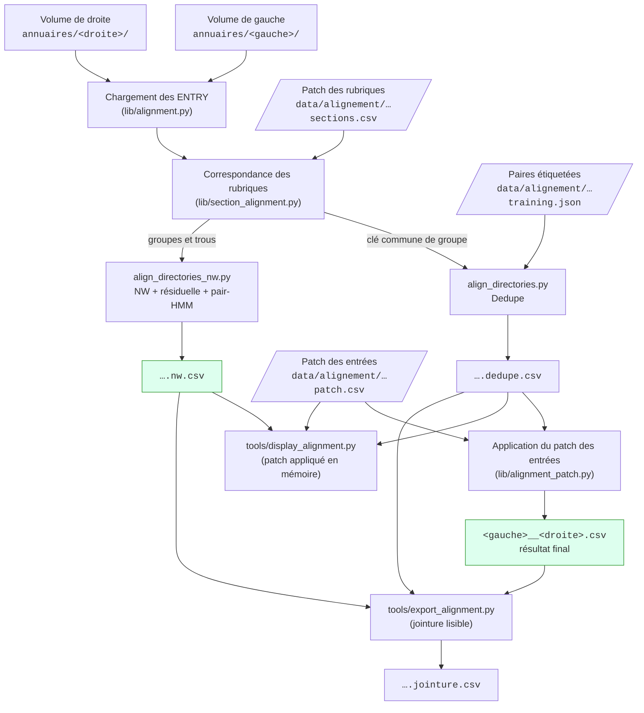

# Documentation de la chaîne de traitement

Ce document décrit en détail chaque étape de la chaîne, ses entrées, ses
sorties et ses points de conception. Le [README](../README.md) en donne la vue
d'ensemble et l'installation.

Documents associés :

- [`guide_annotation_ner.md`](guide_annotation_ner.md) — conventions
  d'annotation des empans `SUBJ` / `DESC` / `ADDR` (étape 5) ;
- [`alignement_ordonne.md`](alignement_ordonne.md) — méthode et
  formalisation de l'alignement ordonné (Needleman-Wunsch + pair-HMM,
  étape 6).

## Sommaire

- [Organisation des fichiers](#organisation-des-fichiers)
- [Étape 1 — Extraction des lignes](#étape-1--extraction-des-lignes--extract_chandra_linespy)
- [Étape 2 — Annotation interactive des lignes](#étape-2--annotation-interactive-des-lignes--annotate_lines_crfpy)
- [Étape 3 — Aplatissement en CSV et curation](#étape-3--aplatissement-en-csv-et-curation--export_lines_csvpy)
- [Étape 4 — Entités et arbre des titres](#étape-4--entités-et-arbre-des-titres--build_entity_treepy)
- [Étape 5 — Segmentation NER](#étape-5--segmentation-ner-subj--desc--addr)
- [Étape 6 — Alignement de deux éditions](#étape-6--alignement-de-deux-éditions)
- [Audit du CRF](#audit-du-crf--audit_crf_featurespy)
- [Fichiers produits](#fichiers-produits)
- [Code partagé](#code-partagé-lib)
- [Conventions des scripts](#conventions-des-scripts)

## Organisation des fichiers

Chaque annuaire a son dossier de volume dans `annuaires/` (hors git). La
sortie OCR complète est découpée en **plages de pages** (partie utile de
l'annuaire, liste annexe…), chacune dans son sous-dossier ; toute la chaîne
s'exécute par plage, et les fichiers de chaque étape s'accumulent à côté de
leur entrée en allongeant le nom :

```text
annuaires/
├── 1808_AD75-PER292/                         dossier de volume
│   ├── 1808_AD75-PER292.ocr.json             sortie OCR Chandra complète
│   ├── 7-186/                                plage de pages
│   │   ├── 1808_AD75-PER292.7-186.ocr.json                     pages de la plage
│   │   ├── ….ocr.lines.json                                   étape 1
│   │   ├── ….ocr.lines.crf-session.json                       étape 2 (session)
│   │   ├── ….ocr.lines.annotated.json                         étape 2
│   │   ├── ….ocr.lines.annotated.csv                          étape 3
│   │   ├── ….ocr.lines.annotated.curated.csv                  étape 3 (curation)
│   │   ├── ….ocr.lines.annotated.curated.merged.csv           étape 4
│   │   ├── ….ocr.lines.annotated.curated.merged.report.txt    étape 4
│   │   ├── ….ocr.lines.annotated.curated.merged.ner.csv       étape 5
│   │   └── ….ocr.lines.annotated.curated.merged.ner.curated.csv  étape 5 (relecture)
│   └── 188-194/
└── alignements/                              sorties de l'étape 6
```

Une plage s'extrait de la sortie OCR complète avec `jq`, par exemple :

```bash
jq 'map(select(.page_index >= 6 and .page_index <= 185))' \
    annuaires/1808_AD75-PER292/1808_AD75-PER292.ocr.json \
    > annuaires/1808_AD75-PER292/7-186/1808_AD75-PER292.7-186.ocr.json
```

Les étapes 1 à 4 sur une plage, avec ces noms de fichiers :

```bash
P=annuaires/1808_AD75-PER292/7-186/1808_AD75-PER292.7-186
uv run extract_chandra_lines.py $P.ocr.json --notables -o $P.ocr.lines.json
uv run annotate_lines_crf.py $P.ocr.lines.json -o $P.ocr.lines.annotated.json \
    --session $P.ocr.lines.crf-session.json
uv run export_lines_csv.py $P.ocr.lines.annotated.json -o $P.ocr.lines.annotated.csv
# curation manuelle : $P.ocr.lines.annotated.curated.csv (colonne prediction_curated)
uv run build_entity_tree.py $P.ocr.lines.annotated.curated.csv
```



En pointillés, les interventions manuelles ; en vert, les livrables.

## Étape 1 — Extraction des lignes : `extract_chandra_lines.py`

Parse le HTML de chaque bloc de la sortie Chandra et le convertit en lignes
Markdown, avec leur provenance (page, bloc, position).

```bash
uv run extract_chandra_lines.py <plage>.ocr.json --notables -o <plage>.ocr.lines.json
```

- **Entrée :** le JSON OCR de Chandra (`<nom>.ocr.json` : `markdown` et
  `html` par page, blocs repérés par `data-block-id`).
- **Sortie :** une copie du JSON où chaque page reçoit une liste
  `data_blocks`, chacun portant sa liste de `lines` (`uid`, `line_index`,
  `markdown`). Défaut : `<entrée>.chandra.json`.
- **`--notables`** : exporte chaque cellule de tableau comme une ligne
  séparée, sans syntaxe Markdown de tableau.
- Ce schéma (pages → `data_blocks` → `lines`) est le **contrat partagé** des
  étapes 2 et 3 ; il est décrit et validé en un seul endroit,
  `lib/chandra_document.py` (`iter_line_locations`). C'est là qu'il faut le
  modifier.

## Étape 2 — Annotation interactive des lignes : `annotate_lines_crf.py`

Un CRF (`python-crfsuite`), réentraîné au fil de l'annotation, propose les
lignes les plus utiles à annoter (graine diversifiée, puis échantillonnage
par incertitude) et prédit les autres.

```bash
uv run annotate_lines_crf.py <plage>.ocr.lines.json \
    -o <plage>.ocr.lines.annotated.json \
    --session <plage>.ocr.lines.crf-session.json
```

- **Entrée :** le JSON de l'étape 1, ou un JSON déjà partiellement annoté
  par ce script.
- **Sortie :** le même JSON, où chaque ligne reçoit `prediction`,
  `provenance` (`human` / `model` / `unclassified`), `probability` et
  `timestamp`. Défaut : `predictions_crf.json`.
- **Session :** réécrite après chaque action (défaut :
  `<entrée>.crf-session.json`) ; l'annotation reprend exactement où elle a
  été arrêtée. `--reset-session` l'ignore.
- **Classes :** `B-ENTRY`, `I-ENTRY`, `SUB-ENTRY`, `B-TITLE`, `I-TITLE`,
  `OUT OF SCOPE`, `¯\_(ツ)_/¯` (incertain).
- **`--seed-size`** : nombre d'annotations diversifiées avant l'échantillonnage
  par incertitude (défaut : 12).

Boucle d'annotation :


Points de conception :

- Les features sont calculées sur le texte normalisé (`normalize_line` :
  marqueurs d'emphase, `#` de tête et espaces finaux retirés ; l'italique
  est gardé comme feature). Elles sont définies dans `lib/crf/features.py`
  (`PRODUCTION_GROUPS`) ; les modifier change le comportement de
  l'annotateur — pour essayer une feature, voir
  [l'audit du CRF](#audit-du-crf--audit_crf_featurespy).
- La feature `is_page_start` signale une rupture de page sans utiliser le
  numéro de page, qui généraliserait mal d'un document à l'autre.
- La probabilité exportée est l'argmax des **marginales a posteriori**, pas
  un décodage de Viterbi : elle correspond toujours à l'étiquette exportée.
- Le tableau de bord (`rich`) montre le contexte du document à gauche, les
  statistiques (progression, transitions apprises, probabilités des
  candidates) à droite.

## Étape 3 — Aplatissement en CSV et curation : `export_lines_csv.py`

Convertit le JSON, annoté ou non, en CSV : une ligne Markdown par ligne.

```bash
uv run export_lines_csv.py <plage>.ocr.lines.annotated.json -o <plage>.ocr.lines.annotated.csv
```

- **Colonnes :** `uid`, `page_index`, `chunk_index`, `data_block_index`,
  `line_index`, `data_block_bbox`, `data_block_label`, `markdown`,
  `prediction`, `provenance`, `probability`, `timestamp` (`CSV_FIELDS`).
- Sur le JSON brut de l'étape 1, les colonnes de prédiction sont vides :
  pratique pour inspecter l'extraction.
- **Curation :** le CSV est relu et corrigé à la main dans
  `<plage>.ocr.lines.annotated.curated.csv`, avec une colonne
  `prediction_curated` (classe vérifiée). Le texte peut aussi y être corrigé,
  notamment les marqueurs de titre `#`. Ces fichiers servent de référence à
  l'audit du CRF.

## Étape 4 — Entités et arbre des titres : `build_entity_tree.py`

Recompose les entités logiques (une entrée, un titre) à partir des classes
de lignes, rattache chaque ligne produite à son titre parent et écrit un
rapport.

```bash
uv run build_entity_tree.py <plage>.ocr.lines.annotated.curated.csv
```

- **Entrée :** un CSV de l'étape 3. La classe est lue dans
  `prediction_curated` par défaut (`--class-column prediction` pour un CSV
  non curé).
- **Sorties :**
  - `<entrée>.merged.csv` — une ligne par entité : `ENTRY`, `TITLE` ou
    `OUT OF SCOPE` (toute classe inconnue est recopiée telle quelle), avec
    son `uuid` et le `parent_uuid` de son titre parent ;
  - `<sortie>.report.txt` — comptages, arbre indenté des titres (entrées
    directes et de tout le sous-arbre) et cas à vérifier.

### Fusion des lignes

Deux « pistes » indépendantes, ENTRY et TITLE, restent ouvertes tant
qu'aucune nouvelle racine `B-ENTRY` / `B-TITLE` n'apparaît : une entrée
peut ainsi continuer par-dessus une ligne `OUT OF SCOPE` ou un titre courant.



- Une continuation sans racine (surtout en début de fichier) devient une
  nouvelle racine de son type et est signalée dans le rapport.
- L'ordre alphabétique des `ENTRY` est vérifié dans l'ordre du document et
  réinitialisé à chaque `TITLE` ; les ruptures sont listées avec l'`uid` de
  l'entrée fautive.
- Une classe inconnue est traitée comme hors champ et signalée à part :
  renommer une classe de ligne impose de mettre ce script à jour.

### Identifiants et hiérarchie

- **`uuid`** est déterministe : uuid5 du nom du document et des `uid` des
  lignes qui composent l'entité (suffixe `#n` si deux entités ont la même
  composition), jamais de son texte. Il survit aux corrections de texte et
  ne change que si l'entité est recomposée.
- **`parent_uuid`** : le niveau d'un titre est son nombre de `#` (un titre
  sans `#` prend le niveau le plus profond et est signalé). Le parent d'un
  `TITLE` est le dernier titre précédent de niveau strictement inférieur ;
  celui de toute autre ligne, le dernier titre précédent. Les titres de
  premier niveau et les lignes placées avant tout titre ont pour parent la
  racine `00000000-0000-0000-0000-000000000000`, commune à tous les
  documents.

Pour recompter les entrées depuis le CSV : grouper les `ENTRY` par
`parent_uuid` (entrées directes), puis cumuler en remontant les
`parent_uuid` des titres.

## Étape 5 — Segmentation NER (SUBJ / DESC / ADDR)

Chaque ENTRY est découpée en empans `SUBJ` (qui ?), `DESC` (quoi ?) et
`ADDR` (où ?) par un modèle GLiNER-bi. Les conventions sont fixées dans
[`guide_annotation_ner.md`](guide_annotation_ner.md). Les modèles entraînés
restent hors git (`models/`).

Deux jeux de données versionnés, aux rôles séparés :

| | `data/ner/gold.ls.json` | `data/ner/train.ls.json` |
|---|---|---|
| Rôle | **évaluer** (`audit_ner.py`) | **entraîner** (`tools/train_gliner.py`) |
| Taille | 600 entrées | ~15 000 entrées |
| Origine | tiré une fois (`tools/sample_ner_gold.py`), relu entrée par entrée dans Label Studio | construit par `tools/build_ner_training.py` à partir des CSV NER de `annuaires/` |
| Qualité | vérité terrain | sortie du modèle, corrigée là où un `*.ner.curated.csv` existe |

Les textes du gold sont toujours exclus de l'entraînement (comparaison sur le
texte normalisé, pas sur l'`uid`).

### Inférence : `infer_gliner.py`

```bash
uv run infer_gliner.py <plage>.….merged.csv --model models/<nom>.gliner-model
```

- Ajoute après `entity` la colonne `tagged_text` (texte d'origine balisé,
  ex. `<SUBJ>Dupont</SUBJ>, <ADDR>rue A, 1.</ADDR>`) et les comptes
  `subject_count`, `description_count`, `address_count`.
- Les libellés sont lus dans `<modèle>/ner_config.json`, écrit à
  l'entraînement. Le modèle reçoit le texte normalisé ; les empans sont
  reportés sur le Markdown d'origine.
- Deux colonnes guident la relecture : `ner_confidence` (score minimal des
  empans) et `ner_suspect`, la liste des motifs de relecture prioritaire
  (`lib/ner/suspicion.py`) :
  - `aucun empan` ;
  - `score bas` (sous `--min-score`, défaut 0,9) ;
  - `texte non couvert` (un mot hors de tout empan) ;
  - `SUBJ absent en tête` ;
  - `signature inhabituelle` (ex. deux SUBJ : deux entrées fusionnées).

  Ces motifs sont structurels et ne dépendent d'aucun lexique propre aux
  volumes.
- La relecture produit `<…>.merged.ner.curated.csv`, entrée de l'étape 6 et
  de la construction du jeu d'entraînement.

### Explorer un volume : `tools/display_directory.py`

```bash
uv run streamlit run tools/display_directory.py
```

Visualiseur d'un CSV NER (`*.merged.ner.csv` ou `*.merged.ner.curated.csv`,
choisi dans `annuaires/` ou téléversé) :

- **Contexte :** empans colorés par classe ; chaque entrée est replacée dans
  sa rubrique (chemin des titres), avec un bandeau à chaque changement de
  rubrique.
- **Filtres :** type de ligne, rubrique (sous-rubriques comprises), pages,
  recherche (texte ou expression régulière), signature, motifs de relecture,
  confiance maximale.
- **Statistiques :** signatures, motifs, et rubriques classées par nombre
  d'entrées suspectes, pour organiser la relecture.
- Pour un CSV sans colonne `ner_suspect`, les motifs structurels sont
  recalculés depuis `tagged_text`.

### Entraînement

```bash
# En local (a besoin de annuaires/) : régénère data/ner/train.ls.json à partir
# des CSV NER (curés en priorité), tiré par forme typographique, gold exclu.
uv run tools/build_ner_training.py
git add data/ner && git commit && git push

# Sur la machine GPU (après git pull && uv sync) :
uv run tools/train_gliner.py data/ner/train.ls.json -o models/<nom>.gliner-model
```

- Le jeu d'entraînement vaut ce que valent les CSV : ils doivent suivre le
  guide d'annotation, car le modèle réapprend les écarts de convention de
  ses données.
- `train_gliner.py` accepte un ou plusieurs fichiers Label Studio, convertit
  les empans en caractères en empans de tokens, calcule `max_width`, exclut
  à nouveau les textes du gold, valide sur un découpage **par page** et
  écrit `<modèle>/ner_config.json`.

### Audit : `audit_ner.py`

```bash
uv run tools/sample_ner_gold.py      # une seule fois : tirage du gold
uv run audit_ner.py --split dev --model models/<actuel>.gliner-model --model models/<nom>.gliner-model
uv run audit_ner.py --split dev --predictions autre=sortie.ner.csv
```

- **Gold :** entrées stratifiées (courant / forme rare / signature rare /
  désaccord) et pondérées pour rester représentatives du corpus ;
  configuration Label Studio dans `data/ner/label_studio_config.xml`.
  Découpage figé `dev` (choix, réglages) / `test` (confirmation du modèle
  retenu, une seule fois). Le gold n'est jamais retiré, pour que les scores
  restent comparables.
- **Métrique principale :** exactitude par entrée (part des entrées sans
  correction à faire), avec intervalle de confiance par bootstrap des pages
  et écarts appariés contre le premier système. Aussi : F1 par classe,
  exactitude par token, types d'erreurs, ventilation par volume / strate /
  profil, couverture et rappel des motifs `ner_suspect`.
- **Sortie :** `rapports/audit_ner/rapport.md` et `erreurs.csv`.
- Une entrée de la strate « courant » pèse environ 1,5 point sur le split
  `dev` : comparer aussi les nombres bruts d'erreurs.
- Les `*.ner.curated.csv` ne sont que partiellement relus : ce ne sont pas
  des vérités terrain.

## Étape 6 — Alignement de deux éditions

Retrouve, entre deux éditions d'un annuaire, les ENTRY qui décrivent la même
personne ou le même commerce. Deux méthodes produisent des correspondances
**un-à-un** au même format :

| | `align_directories.py` | `align_directories_nw.py` |
|---|---|---|
| Principe | [Dedupe](https://github.com/dedupeio/dedupe) `RecordLink` : ressemblance apprise sur des paires étiquetées | ordre des entrées : Needleman-Wunsch par rubrique, puis pair-HMM entre ancres |
| Étiquetage | oui, en console | aucun |
| Corrections manuelles des entrées | appliquées (patch) | non appliquées (seulement dans le viewer) |
| Sortie | `<gauche>__<droite>.dedupe.csv` (brut) et `<gauche>__<droite>.csv` (final) | `<gauche>__<droite>.nw.csv` |
| Durée (1807/1808) | quelques minutes | ~12 s |

Les deux méthodes restent à comparer sur un corpus d'alignements vérifiés.



Les fichiers de `data/alignement/` sont **versionnés** (au contraire de
`annuaires/`) : ils portent tout le travail humain et survivent aux
relances.

### Chargement des volumes

`lib/alignment.py` lit un dossier de volume en entier : ses sous-dossiers de
plages triés par première page, chacun par son propre
`<volume>.<plage>.ocr.lines.annotated.curated.merged.ner.curated.csv`
(`CURATED_NER_SUFFIX` ; un fichier manquant est une erreur). Seules les
ENTRY sont alignées. Pour chacune :

- **rubrique** : titre ancêtre de niveau 2, à défaut de niveau 1, selon
  `parent_uuid` (donc sans héritage d'une plage à l'autre) ; la clé est sans
  accents ni ponctuation, en minuscules ;
- **SUBJ** : texte des empans SUBJ, sans Markdown ;
- **texte** : texte complet sans Markdown. DESC et ADDR, plus variables
  d'une édition à l'autre, n'interviennent que par lui.

### Correspondance des rubriques

Partagée par les deux méthodes et le viewer (`lib/section_alignment.py`).
Une rubrique est une suite contiguë d'ENTRY de même rubrique, identifiée par
l'uuid de son TITLE. L'ordre des rubriques étant stable d'une édition à
l'autre, elles sont alignées par Needleman-Wunsch sur la similarité
Jaro-Winkler de leur clé (seuil 0,8, `lib/sequence.py`) : « Liste » et
« Listes de non-commerçans » se correspondent.

Ce qui échappe à l'ordre ou au seuil se corrige à la main dans
`data/alignement/<gauche>__<droite>.sections.csv` (colonnes `left_uuid,
right_uuid, left_title, right_title, note`) :

- une ligne à deux uuid lie deux rubriques ; un même uuid peut figurer dans
  plusieurs lignes, et les composantes connexes forment des **groupes** 1-1,
  1-N ou N-M (« Jardiniers-fleuristes, pépiniéristes, marchands d'arbres »
  ↔ « Marchands d'arbres ») ;
- une ligne à un seul uuid déclare une rubrique sans correspondance.

Le patch gagne : ses rubriques sont retirées de l'alignement automatique.
Si un uuid disparaît (re-segmentation amont), la ligne est réancrée sur la
rubrique de même titre nettoyé, unique dans l'annuaire, et le patch est
réécrit par les scripts d'alignement ; faute de candidat unique, la ligne
est **orpheline** : signalée, conservée, non appliquée.

### Méthode Dedupe : `align_directories.py`

```bash
uv run align_directories.py annuaires/1807_AD75-PER292 annuaires/1808_AD75-PER292
uv run align_directories.py <gauche> <droite> --label          # compléter l'étiquetage
uv run align_directories.py <gauche> <droite> --apply-only     # réappliquer le patch, sans Dedupe
uv run align_directories.py <gauche> <droite> --raw-sections   # variante à clés de rubrique brutes
```

- **Champs comparés :** rubrique, SUBJ et texte, en minuscules. La rubrique
  est comparée par la **clé commune de son groupe** (clé de sa première
  rubrique de gauche) : deux rubriques appariées ont la même clé. Cette
  substitution est aussi appliquée, à la lecture, aux paires du fichier
  d'entraînement, qui reste donc valable. `--raw-sections` garde les clés
  propres à chaque volume et écrit
  `<gauche>__<droite>.rubriques-brutes[.dedupe].csv`, pour comparer les deux
  variantes.
- **Étiquetage :** à la première exécution (ou avec `--label`), Dedupe
  propose des paires en console (`y` / `n` / `u` incertain / `f` terminer).
  Elles sont enregistrées dans
  `data/alignement/<gauche>__<droite>.training.json` et réutilisées ensuite
  sans interaction.
- **Seuil :** `--threshold` (score minimal, défaut 0,5).
- **Sorties** dans `annuaires/alignements/`, dans l'ordre de l'annuaire de
  gauche : `<gauche>__<droite>.dedupe.csv` (liens bruts) et
  `<gauche>__<droite>.csv` (résultat final, Dedupe + patch des entrées). La
  console résume les taux d'appariement, la distribution des scores et
  l'effet du patch.
- `prepare_training` prend quelques minutes sur ~17 000 × 16 000 entrées.
  Dedupe 3.0.3 exige `btrees<6` (fixé dans `pyproject.toml`).

### Méthode ordonnée : `align_directories_nw.py`

```bash
uv run align_directories_nw.py annuaires/1807_AD75-PER292 annuaires/1808_AD75-PER292
uv run align_directories_nw.py <gauche> <droite> --no-context   # Needleman-Wunsch seul
```

Sans apprentissage supervisé ; méthode, formalisation et premiers résultats
dans [`alignement_ordonne.md`](alignement_ordonne.md). En bref :

1. rubriques alignées comme ci-dessus ; les entrées sont traitées par
   groupe de rubriques appariées et par « trou » entre deux groupes (rubriques
   non appariées des deux côtés mises en commun) ;
2. Needleman-Wunsch sur les entrées de chaque segment ; ses paires de
   similarité ≥ 0,9 sont des **ancres** ;
3. passe résiduelle (affectation optimale, similarité ≥ 0,85) sur les
   entrées hors des paires NW, pour les inversions locales. Sur le gold des
   inversions 1807/1808, cette règle est précise (≈ 93 %) et ce qu'elle
   manque ne se départage pas automatiquement : les cas douteux vont à la
   relecture (ci-dessous), pas à une règle plus fine ;
4. entre deux ancres consécutives, un **pair-HMM** (`lib/pair_hmm.py`) garde
   les paires de probabilité a posteriori > 0,5 : une paire de similarité
   moyenne encadrée par des paires sûres peut être retenue. Les émissions
   sont estimées sans étiquettes ; seules les transitions sont apprises par
   EM.

La similarité vaut `w · JaroWinkler(SUBJ) + (1 − w) · Indel(texte)` (texte
seul sans SUBJ, `--subj-weight`, défaut 0,5). Les seuils se règlent par
`--threshold`, `--anchor-threshold`, `--residual-threshold` et
`--section-threshold`.

Sortie : `annuaires/alignements/<gauche>__<droite>.nw.csv`, avec `source` =
`nw` (ancre), `nw-contexte` (paire du pair-HMM, score = probabilité a
posteriori) ou `nw-residuel`. Le patch des entrées n'est pas appliqué. La
console affiche les transitions estimées et l'accord avec le `.dedupe.csv`
s'il existe.

### Format des correspondances

Une ligne par correspondance ; une entrée absente du fichier n'a pas de
correspondance.

| Colonne | Contenu |
|---|---|
| `left_file`, `left_uuid`, `right_uuid`, `right_file` | identification des deux entrées |
| `score` | score de la méthode (vide pour une paire saisie à la main) |
| `source` | `dedupe`, `manuel`, `manuel-incertain` (patch, `certitude=incertaine`), `nw`, `nw-contexte` ou `nw-residuel` |
| `left_section`, `right_section` | titres des rubriques, pour la relecture |
| `left_tagged_text`, `right_tagged_text` | textes balisés, pour la relecture |

### Corrections manuelles des entrées

Les méthodes peuvent être relancées à chaque amélioration des étapes amont ;
les décisions humaines vivent donc à part, dans
`data/alignement/<gauche>__<droite>.patch.csv` (`lib/alignment_patch.py`),
réappliqué après chaque exécution de Dedupe.

- **Une ligne = une décision :** `left_uuid` + `right_uuid` → ces deux
  entrées se correspondent ; un seul uuid → cette entrée n'a pas de
  correspondance. Colonnes : `left_file, left_uuid, right_uuid, right_file,
  left_section, right_section, left_tagged_text, right_tagged_text, note,
  certitude`.
- **Décision incertaine :** `certitude = incertaine` quand la relecture n'a
  pas permis de trancher (homonymes, graphies trop éloignées). La paire est
  appliquée avec la source `manuel-incertain`, visible dans l'export
  (`certitude = incertaine`) ; l'utilisateur des données choisit de s'en
  servir ou non. Colonne facultative : un patch sans elle reste valide ;
  toute autre valeur est une erreur.
- **Le patch gagne :** tout lien automatique qui touche un uuid du patch est
  écarté, puis les paires du patch sont ajoutées (`source = manuel`).
  Valider une paire correcte la protège des relances (son score est gardé).
- **Réancrage :** si une entrée est re-segmentée en amont, son uuid change ;
  on cherche alors l'entrée unique de même texte normalisé dans la même
  rubrique (d'où l'instantané texte + rubrique) et le patch est réécrit.
  Sans candidat unique, la ligne est **orpheline** : signalée, conservée,
  non appliquée.
- Un uuid présent dans deux lignes, ou une ligne sans uuid, est une erreur.

### Explorer et corriger : `tools/display_alignment.py`

```bash
uv run streamlit run tools/display_alignment.py
```

Le viewer est en lecture seule. On choisit une sortie brute (`*.dedupe.csv`,
`*.nw.csv` ou une variante `rubriques-brutes`) ; la paire de volumes se
déduit du nom de fichier, les deux annuaires sont relus en entier et le
patch des entrées est appliqué en mémoire : l'écran montre le résultat
final.

- **Une table dans l'ordre naturel :** correspondances et entrées de gauche
  sans correspondance dans l'ordre de l'annuaire de gauche ; une entrée de
  droite sans correspondance vient après la paire qui contient l'entrée de
  droite appariée qui la précède. Un bandeau marque chaque changement de
  rubrique.
- **Filtres :** types de lignes (correspondances, sans correspondance à
  gauche / à droite), rubrique, recherche, plage de scores, rubriques non
  correspondantes (paires dont les rubriques ne se correspondent pas selon
  la correspondance des rubriques), corrections manuelles ; tri par score
  pour relire les cas limites.
- **Relecture** (`lib/alignment_review.py`, voir ci-dessous) : chaque
  correspondance porte une incertitude (faible, moyenne, forte) et ses
  motifs ; les **candidates non appariées** (deux entrées sans
  correspondance, chacune la plus proche de l'autre, dans la zone grise de
  similarité) occupent une ligne sur fond jaune. Le filtre *Incertitude*
  ne garde que les lignes d'incertitude moyenne ou forte (ou forte
  seulement), le tri *incertitude décroissante* les place en tête ; le seuil
  bas des candidates et l'écart « homonyme proche » se règlent dans la
  barre latérale.
- **Encarts :** lignes orphelines des deux patchs, bilan par rubrique,
  correspondance des rubriques.
- **Copie pour les patchs :** le bouton `uuid` d'une entrée ou d'un bandeau
  de rubrique copie son uuid ; le bouton `copier` d'une ligne copie une
  ligne de patch prête à coller (la paire, ou l'entrée seule) ; le bouton
  `incertaine` d'une paire ou d'une candidate copie la même ligne avec
  `certitude=incertaine` ; `en-tête du patch` copie l'en-tête pour créer le
  fichier.
- **Export CSV :** le bouton *Exporter en CSV* de la barre latérale
  télécharge les lignes affichées (filtres et tri appliqués) au format de
  `tools/export_alignment.py` (ci-dessous) ; la case *Pour un tableur en
  français* (cochée par défaut) choisit le séparateur `;` et l'UTF-8 avec
  BOM.

Les patchs s'éditent à la main (tableur ou éditeur de texte) : coller une
ligne copiée valide une paire ou confirme une absence de correspondance ;
pour apparier deux entrées, coller la ligne de l'une et y reporter l'`uuid`
(et le fichier) de l'autre. `align_directories.py --apply-only` régénère
ensuite le CSV final en quelques secondes.

Pour tester le viewer, utiliser un wrapper qui redéfinit `ALIGNMENTS_DIR`
et `PATCH_DIR`, jamais les dossiers réels.

### Exporter la jointure : `tools/export_alignment.py`

```bash
uv run tools/export_alignment.py annuaires/alignements/<g>__<d>.nw.csv [--excel] [-o sortie.csv]
```

Produit, pour les utilisateurs des données (historiens), la jointure des
deux `*.ner.curated.csv` alignés : **une ligne par correspondance ou par
entrée sans correspondance**, dans l'ordre naturel du viewer
(`lib/alignment_export.py`, partagé avec lui). L'entrée est une sortie
d'alignement (`*.dedupe.csv`, `*.nw.csv` ou le CSV final) ; comme dans le
viewer, les volumes sont relus en entier et le patch des entrées est
appliqué en mémoire, sans être réécrit (`--sans-patch` l'ignore). Sortie
par défaut : `<entrée sans .csv>.jointure.csv` à côté de l'entrée.

| Colonne | Contenu |
|---|---|
| `statut` | `apparié`, `gauche seulement`, `droite seulement` ou `candidate` (candidate non appariée, seulement avec `--candidates` ou depuis le viewer) |
| `score`, `methode` | Score et source du lien (`dedupe`, `nw`, `nw-contexte`, `nw-residuel`, `manuel`, `manuel-incertain`, `candidate`) ; vides sans correspondance |
| `certitude` | Pour une paire : `relue` (patch), `incertaine` (patch, `certitude=incertaine`) ou `automatique` |
| `niveau_incertitude` | Pour une paire automatique ou une candidate : `faible`, `moyenne` ou `forte` (vide pour une paire relue) |
| `motifs_relecture` | Motifs de cette incertitude (`déduite des voisines (p < 0,9)`, `homonyme proche`, `candidate non appariée`), séparés par « \| » |
| `rubriques_correspondantes` | Pour une paire : `oui` si les rubriques des deux entrées se correspondent (correspondance des rubriques et son patch), sinon `non` — à vérifier en priorité |
| `gauche_…`, `droite_…` | Pour chaque côté : `volume`, `page`, `rubrique` (titre lisible), `texte` (sans Markdown), `sujet` / `description` / `adresse` (texte des empans SUBJ / DESC / ADDR, plusieurs empans d'une classe séparés par « \| »), `texte_balise` (`tagged_text` d'origine), `uuid` |

`--excel` écrit avec le séparateur `;` et en UTF-8 avec BOM, qu'un tableur
réglé en français ouvre directement ; sans l'option, CSV standard (`,`,
UTF-8). `--candidates` ajoute les candidates non appariées ; `--ecart`
règle l'écart « homonyme proche ».

### Relecture ciblée : motifs et incertitude

L'alignement automatique n'est pas modifié : `lib/alignment_review.py`
signale seulement, après coup, les décisions qu'une relecture humaine peut
corriger, avec un motif explicite (même principe que `ner_suspect` pour la
NER). Calcul par segment, avec la similarité de la méthode ordonnée :

| Motif | Concerne | Règle |
|---|---|---|
| `déduite des voisines (p < 0,9)` | paire `nw-contexte` | retenue par le pair-HMM parce que ses voisines sont appariées, mais de probabilité a posteriori < 0,9 |
| `homonyme proche` | paire `nw`, `nw-residuel` ou `dedupe` | une autre entrée du segment, d'un côté ou de l'autre, est à moins de 0,05 de similarité (`--ecart`) |
| `candidate non appariée` | deux entrées sans correspondance | chacune est la plus proche de l'autre dans le segment, similarité dans [τ ; θr[ (seuils de Needleman-Wunsch et de la passe résiduelle) ; jamais une entrée déclarée seule au patch |

L'**incertitude** est ordinale (pour trier, ce n'est pas une probabilité) :
`faible` sans motif ; `moyenne` avec un motif ; `forte` pour une candidate
non appariée, plusieurs motifs ou une paire déduite des voisines de
probabilité < 0,7. Aucun paramètre n'est appris sur un volume. Sur
1807/1808 : 445 lignes à vérifier (258 d'incertitude moyenne, 187 forte)
pour 14 491 paires. Les décisions vont au patch des entrées ; les
conventions de relecture sont dans
[`guide_relecture_alignement.md`](guide_relecture_alignement.md).

### Gold des inversions et audit de la relecture

```bash
uv run tools/sample_alignment_gold.py annuaires/<g> annuaires/<d> [--per-stratum 4]   # une fois par paire
uv run tools/audit_alignment_review.py data/alignement/<g>__<d>.gold-inversions.csv
```

- `tools/sample_alignment_gold.py` tire des paires candidates
  « inversion » (entrées laissées seules par Needleman-Wunsch, qui croisent
  au moins une paire ordonnée ; meilleure partenaire croisée de chaque
  entrée de gauche), stratifiées par déplacement × similarité, avec leur
  poids. On les étiquette à la main dans `meme_entree` : `OUI`, `NON` ou
  `INCERTAIN`, selon le guide de relecture. Un fichier existant n'est
  jamais écrasé sans `--force`.
- `tools/audit_alignment_review.py` en tire `rapports/audit_alignement/<g>__<d>.md` :
  précision et gain plafond de la règle de la passe résiduelle, devenir de
  chaque paire du gold selon la relecture (retenue avec ou sans motif,
  candidate non appariée, ni l'une ni l'autre), part de OUI par
  incertitude, charge de relecture. Le gold ne contenant que des
  inversions, le motif `déduite des voisines` n'y est pas évalué.
- **Pour une nouvelle paire d'annuaires**, les seuils ne sont pas à
  reprendre de 1807/1808 les yeux fermés : tirer un petit gold
  (`--per-stratum 4`, ≈ 100 paires), l'étiqueter, lancer l'audit, et
  n'ajuster τ, θr ou `--ecart` que si le rapport l'exige (part de OUI qui ne
  baisse plus de l'incertitude faible à forte, règle imprécise, motifs qui n'attrapent pas
  les erreurs).

## Audit du CRF : `audit_crf_features.py`

Mesure la performance du CRF de l'étape 2 et l'apport de chacune de ses
features, contre les CSV curés `*.ocr.lines.annotated.curated.csv`
(colonne `prediction_curated`).

```bash
uv run audit_crf_features.py                 # tous les CSV curés sous annuaires/
uv run audit_crf_features.py a.curated.csv b.curated.csv -o rapports/mon_audit
```

- **Entrées :** les CSV curés et, à côté de chacun, le
  `<nom>.ocr.lines.json` qu'a vu l'annotateur. Les features sont calculées
  sur ce JSON, et les classes curées y sont alignées par `uid`
  (`lib/crf/silver.py`) : le texte ayant parfois été corrigé à la curation
  (marqueurs `#`), calculer les features sur le CSV curé ferait fuiter les
  étiquettes.
- **Référence « silver » :** les classes curées ne diffèrent des prédictions
  d'origine que sur ~0,2 % des lignes ; les scores absolus sont donc
  optimistes.
- **Sortie :** `rapports/audit_crf/` par défaut — `rapport.md` (résumé,
  recommandations, analyses), tables CSV et `resume.json`.
- **Contenu :** performances par classe et par entité (règles de l'étape 4)
  selon deux validations croisées (intra-document par blocs de pages
  contiguës ; un volume laissé de côté), avec bootstrap par page ;
  calibration ; information mutuelle et redondance des features ; ablations
  jugées contre un plancher de bruit mesuré par des features placebo ;
  groupes candidats ; courbe d'apprentissage ; analyse d'erreurs.
- **Options :** `--workers`, `--bootstrap`, `--folds`,
  `--no-learning-curve` / `--no-candidates` / `--no-single-groups` (plus
  rapide), `--hyperparams` (grille c1 × c2).

Pour tester une feature, ajouter un groupe à `CANDIDATE_GROUPS` dans
`lib/crf/features.py` : l'audit l'évalue sans changer l'annotateur.
`LEGACY_GROUPS` reproduit un jeu de features antérieur, évalué comme
`production_v1` pour comparaison.

## Fichiers produits

| Fichier | Produit par | Contenu |
|---|---|---|
| `….ocr.lines.json` | `extract_chandra_lines.py` | Pages → blocs → lignes Markdown (`uid`, `line_index`, `markdown`) |
| `….ocr.lines.annotated.json` / `.crf-session.json` | `annotate_lines_crf.py` | Classe, provenance, probabilité de chaque ligne ; session reprenable |
| `….ocr.lines.annotated.csv` | `export_lines_csv.py` | Une ligne CSV par ligne Markdown |
| `….annotated.curated.csv` | curation manuelle | Le même, avec `prediction_curated` |
| `….merged.csv` | `build_entity_tree.py` | Une ligne par entité (`ENTRY`, `TITLE`, `OUT OF SCOPE`) avec `uuid`, `parent_uuid`, texte fusionné et provenance |
| `….merged.report.txt` | `build_entity_tree.py` | Comptages, arbre des titres, cas à vérifier |
| `….merged.ner.csv` | `infer_gliner.py` | Le CSV d'entités avec `tagged_text`, comptes d'empans, `ner_confidence`, `ner_suspect` |
| `….merged.ner.curated.csv` | relecture manuelle | Le même, corrigé |
| `annuaires/alignements/<g>__<d>.dedupe.csv` | `align_directories.py` | Correspondances brutes de Dedupe |
| `annuaires/alignements/<g>__<d>.csv` | `align_directories.py` | Correspondances finales (Dedupe + patch) |
| `annuaires/alignements/<g>__<d>.nw.csv` | `align_directories_nw.py` | Correspondances de la méthode ordonnée |
| `annuaires/alignements/<g>__<d>.….jointure.csv` | `tools/export_alignment.py`, viewer | Jointure lisible des deux volumes alignés (pour les utilisateurs des données) |
| `data/alignement/<g>__<d>.training.json` | `align_directories.py --label` | Paires étiquetées pour Dedupe (versionné) |
| `data/alignement/<g>__<d>.sections.csv` | édition manuelle | Patch des rubriques (versionné) |
| `data/alignement/<g>__<d>.patch.csv` | édition manuelle | Patch des entrées (versionné) |
| `data/alignement/<g>__<d>.gold-inversions.csv` | `tools/sample_alignment_gold.py` + étiquetage manuel | Gold des inversions (versionné) |
| `data/ner/gold.ls.json`, `data/ner/train.ls.json` | `sample_ner_gold.py` + Label Studio, `build_ner_training.py` | Gold d'évaluation et jeu d'entraînement NER (versionnés) |
| `rapports/audit_crf/`, `rapports/audit_ner/`, `rapports/audit_alignement/` | audits | Rapports Markdown et tables |

## Code partagé (`lib/`)

Les scripts de la racine importent `lib.…` et s'exécutent donc depuis la
racine du dépôt ; ceux de `tools/` ajoutent la racine à `sys.path`.

| Module | Rôle |
|---|---|
| `lib/chandra_document.py` | Schéma pages → `data_blocks` → `lines`, validation et parcours (`iter_line_locations`) |
| `lib/crf/` | Cœur du CRF : `features.py` (groupes de features), `model.py` (entraînement, marginales), `active_learning.py` (moteur de l'annotateur), `silver.py` et `evaluation.py` (audit) |
| `lib/titles.py` | Niveau et texte lisible des titres |
| `lib/ner/` | `spans.py` (empans, `tagged_text`, Label Studio, normalisation Markdown), `html.py` (rendu des empans pour les viewers), `shapes.py` (formes typographiques), `corpus.py` (lecture des CSV NER), `metrics.py`, `suspicion.py` (motifs de relecture), `gliner.py` (chargement et prédiction) |
| `lib/alignment.py` | Chargement des volumes, champs comparés, lecture et écriture des correspondances |
| `lib/alignment_patch.py` | Patch des entrées |
| `lib/alignment_export.py` | Jointure dans l'ordre naturel (viewer) et export CSV lisible |
| `lib/alignment_review.py` | Motifs de relecture, incertitude et candidates non appariées |
| `lib/section_alignment.py` | Correspondance des rubriques et son patch |
| `lib/sequence.py` | Needleman-Wunsch |
| `lib/pair_hmm.py` | Pair-HMM de la méthode ordonnée |
| `lib/stats.py`, `lib/reporting.py` | Bootstrap, intervalles, calibration ; mise en forme Markdown des rapports d'audit |

## Conventions des scripts

- Un script autonome par étape, CLI en français (`argparse`) ; `-o/--output`
  a toujours une valeur par défaut dérivée du nom d'entrée.
- Sortie console via `rich` (`✅` pour un succès, `[bold red]Erreur :[/]`
  pour un échec attendu).
- Existence des fichiers d'entrée vérifiée avant tout traitement ; erreurs
  typées plutôt que des `except Exception` génériques, sauf pour
  l'inférence GLiNER par lots (`lib/ner/gliner.py`), qui doit résister aux
  erreurs imprévisibles de torch.
- Tests : `unittest` (pas pytest), lancés depuis la racine.
